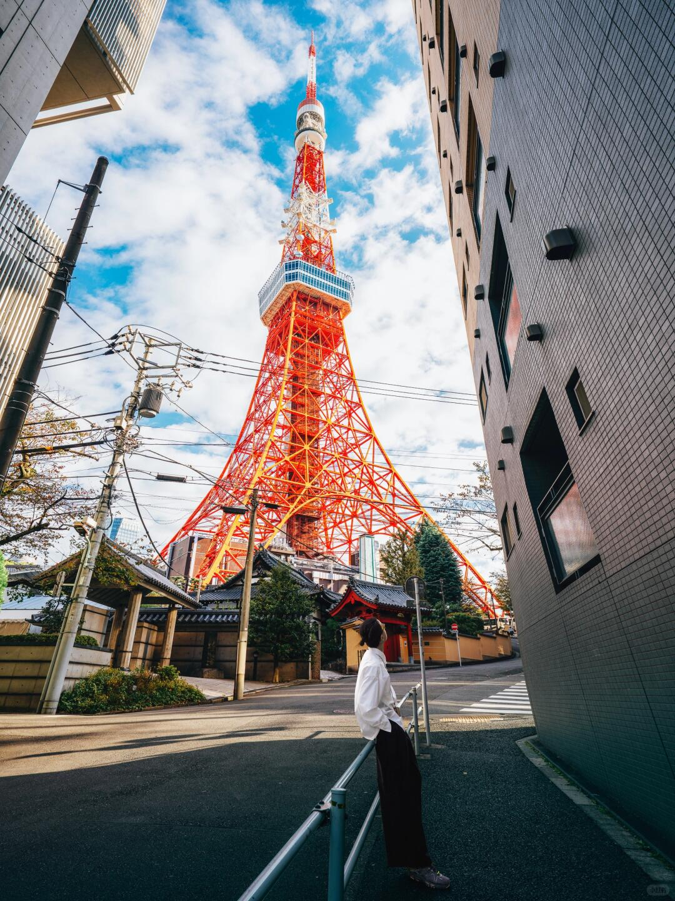
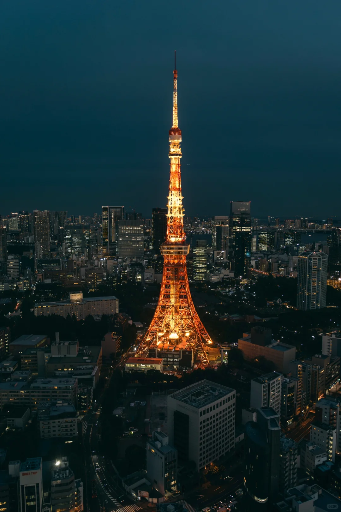
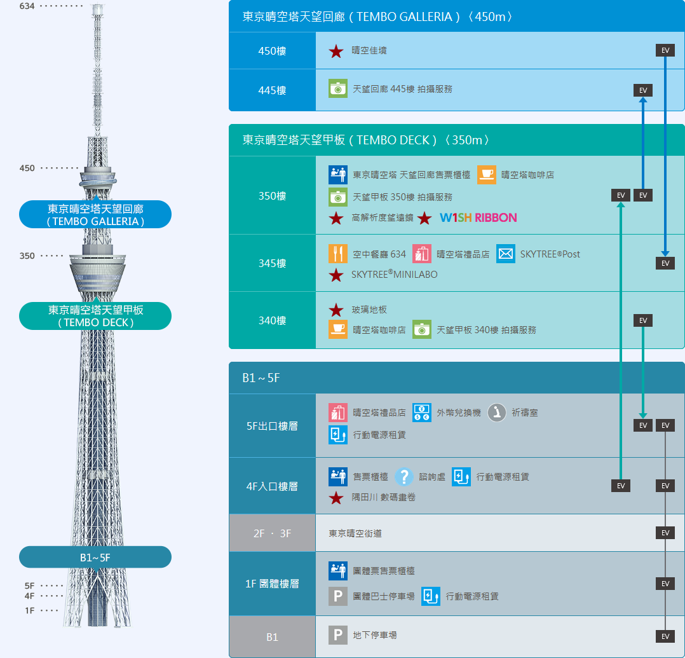
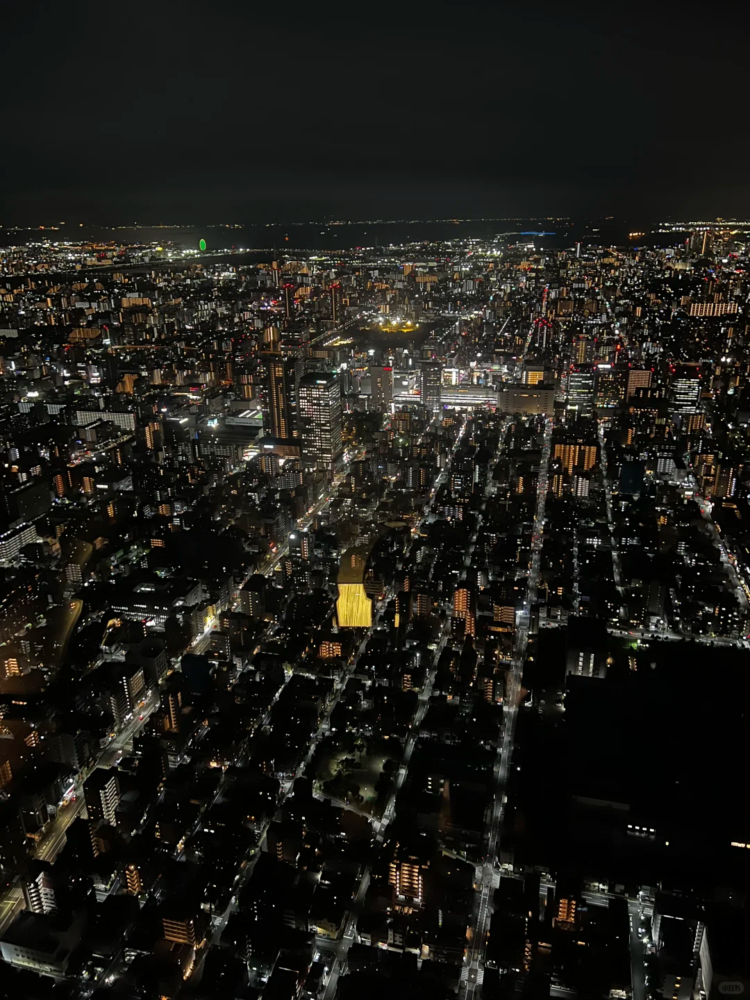
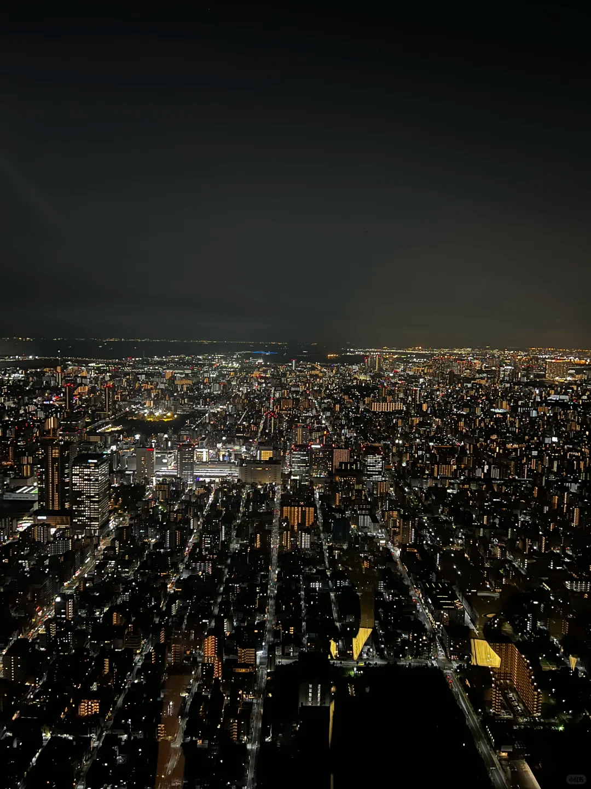
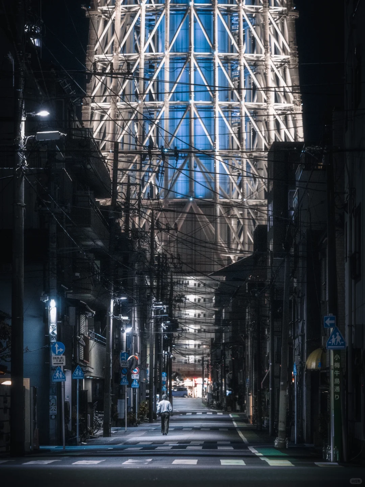
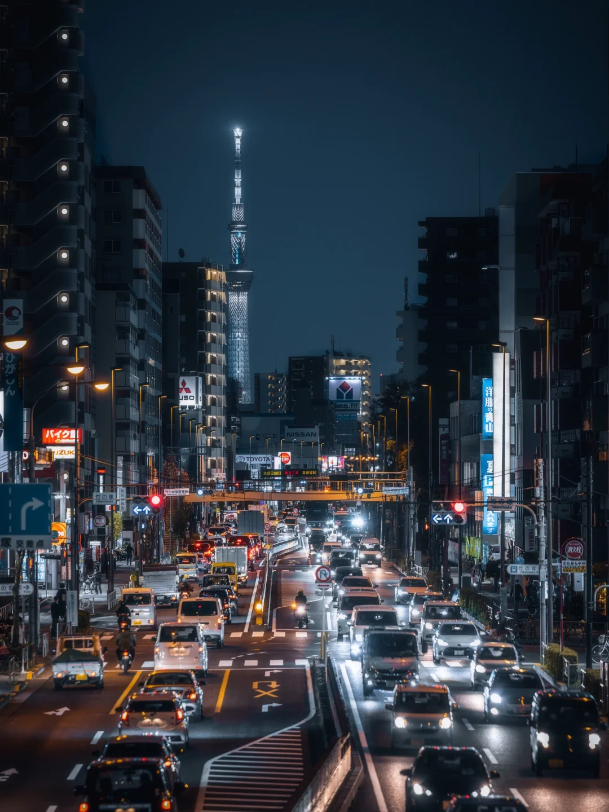
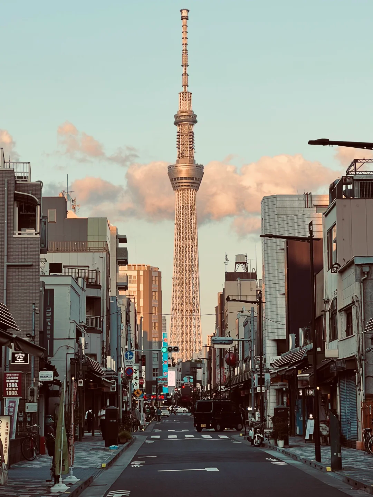
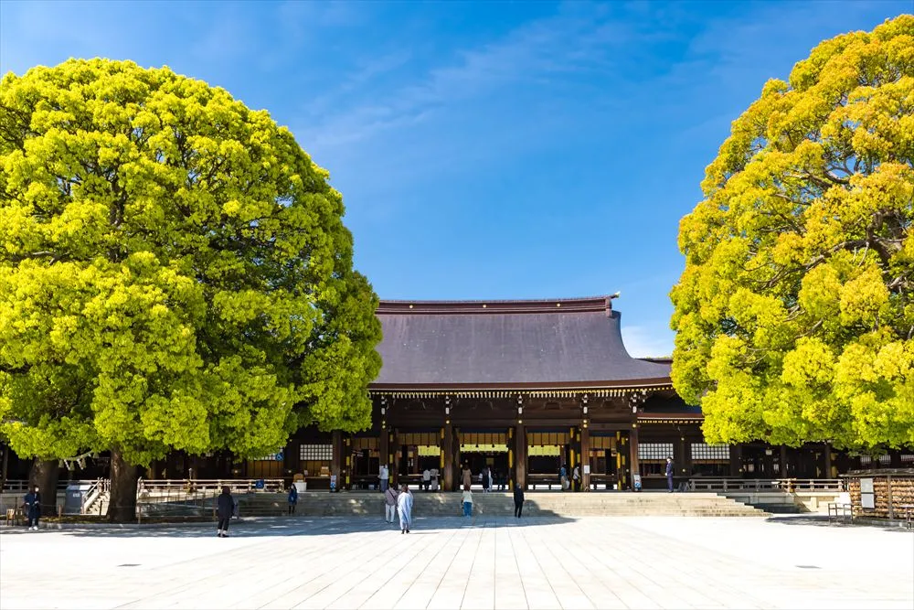

# 东京 Toyko

东京，旧名江户（即“河口”之意，起源于隅田川流入当时称为“江户内海”的东京湾）。

1603年，**德川家康**打败众多其它大名，完成日本的大一统，在**江户**建立城堡，创立江户**幕府**，开启了**江户时代**（德川家康成为日本的实际统治者，而当时的朝廷是丰臣政权，是丰臣秀吉的后代丰臣秀赖）。

1867年**大政奉还**（日本江户幕府的第十五代将军德川庆喜将政权还给了明治天皇，这一事件标志着持续264年的江户幕府统治结束）后，政治权力回到了天皇手上，也开启了明治维新。**都城**也随之从京都**迁至江户**，并改称为东京。

1923年关东大地震、二战期间大范围遭受美国空袭，曾让东京遭遇两次毁灭性的破坏，但随后却也都迅速进行重建工作，凭借在重建过程中充分考虑东京在震灾前就有的问题、灾后土地的收购顺利等因素，东京经济迅速恢复，目前已发展成为最现代化的城市之一。

东京的GDP为全球第二，在2016年达9,730亿美元，而同时东京都会区（一都三县）则高达1.8万亿美元，若将东京视为一个国家，其GDP总量高于加拿大、韩国、俄罗斯等，位列世界第八。东京为亚洲最重要的世界级城市之一，也是传统上的**全球四大世界级城市**（伦敦、纽约、巴黎、东京）之一。

东京于1964年、2020年共两次举办奥运会，也是目前第一个两次主办奥运会的亚洲城市。

## 1.1 路线

## 1.2 景点

### 东京铁塔

东京塔，正式名称为日本电波塔，建于1958年。高332.9米，是日本第二高的建筑。东京塔外形模仿巴黎埃菲尔铁塔建造，塔身间隔涂装白色和红色。

**增上寺**

东京塔脚下是一大片的墓地，是德川家族的墓地，其中包含第六代、第七代等六位将军，而这片墓地属于增上寺

**拍摄机位建议**

- Tofu Ukai 東京 芝 とうふ屋うかい 对面台阶下

	
	

- 北海道ワイン㈱ 東京営業所 ----- Kaledo Tower（右图）

- 赤羽桥站E21出口（东京铁塔指示牌）

	
	

- 札の辻(三田站)（左图）---------六本木堂吉诃德（右图）

- 麻布台Hills观景平台33层

2024年11月的笔记，说无需预约也不花钱：
地址：Azabudai Hills Mori JP Tower(麻布台Hills）从1楼大门进去找到S2电梯上34楼（是的上34楼不是33楼）到达34楼后有个楼梯步行下到33楼即可开拍

**不建议入塔，看着一般**

**门票**

|区域|成人|
|-|-|
|MAIN DECK（150m） 即主观景台|1500日元（约72.24人民币）|
|TOP DECK Tour (150m & 250m) 顶层观景台|网上购票3300日元（约158.93人民币） 柜台购票3500日元（约168.56人民币）|
|TOKYO DIAMOND TOUR(钻石之旅)|7000日元（约337.12人民币）|

**FOOT TOWN**

共5层，1-3层都是商场、吃的，4、5是娱乐（例如攀岩）

左为**MAIN DECK** ；右为**TOP DECK**

**钻石之旅**

需提前预约，1小时一批，参加者可以享受到头等舱贵宾待遇：在专属豪华休息室休息，通过专用通道和专属电梯前往顶层观景台；期间同行的表演者会以唱歌和表演等方式，为观景之行增添更多乐趣。

### 东京晴空塔

因城市发展，东京塔的高度不再满足这座巨大城市对信号发射塔的需求。东京决定再建造一座更高的塔。

[东京晴空塔](https://www.tokyo-skytree.jp/)，也叫做“**天空树**”，2008年7月开工，竣工于2012年，高度634米，是东京目前的广播电视塔，也是目前为止全世界最高广播电视塔（比广州塔高34米）。（是世界第二高建筑，仅次于迪拜哈利法塔（828米））

**营业时间**
9:00 - 22:00

**门票**
有一个微信公众号，还有[晴空塔官网](https://www.tokyo-skytree.jp/cn_t/ticket/individual/)，两个平台报价不一致（也有可能是因为我在微信公众号里没点到详情里）

- 提前一天购买预售票即可；
- 预售票有两个门票价格，是因为工作日和节假日的区别

|入场券|区域|价格|
|-|-|-|
|预售票|天望回廊（450m）+ 天望甲板（350m）套票|3100或3400日元（约150.25或164.79元人民币）|
|预售票| 天望甲板（350m）套票|2100或2300日元（约101.78或111.48元人民币）|
|当日票 |天望回廊（450m）+ 天望甲板（350m）|3500或3800日元（约169.64或184.18元人民币）|
|当日票 |天望甲板（350m）|2400或2600日元（约116.32或126.02元人民币）|

**拍摄机位概览**

- 押上京成桥 --------------------- 向島１丁目９−3

- 第３東武館 --------------------- 足立区日光街道

- ふれあい橋 --- まいばすけっと 西浅草２丁目店（浅草寺旁）

- 東日本橋２丁目２０−3（需要超长焦）

### 浅草寺

**无需门票，与晴空塔、秋叶原相近**

东京最古老的寺院。江户时代的初期，由德川家康公决定幕府的祈福所之后，堂塔的威容更进一步完善，作为江户文化的中心繁荣起来。

主佛是圣观世音菩萨。观音有11面、1000手、如意轮等各种姿态，圣观音是其基本。

浅草寺在二战期间被炸毁，于1960年重建。

	

	

		<h5>正殿（观音堂）</h5>
		
		
1958年，在全国信徒的帮助下重建的现本堂是1945年3月10日在战灾中烧毁的旧本堂(国宝，德川家光建立)相同形态。 屋顶的斜坡非常陡，其特点是与其他寺院相比，楼高得多。
	佛堂面向南方，分为内阵和外阵，内阵中心有供奉主佛观世音菩萨的御宫殿。

	

	

		<h5>影向堂（御朱印所）</h5>
		
		
对于观音的说法和活跃表现，赞颂合作的佛法被称为”影子向众”。 供奉着作为每个人的出生年守本尊的8尊佛。
这里授予浅草寺的御朱印。

	

	

		<h5>淡岛堂</h5>
		
		
于元禄年间(1688至1704年)请来和歌山加太的淡岛明神，建立佛堂。 中尊有阿弥陀如来像，两侧坛保护淡岛明神和虚空藏菩萨。 这个寺院在战后不久就是临时正殿，1994年通过曵屋作业迁移到现在的所在地，直到今天。

	

	

		<h5>五重塔</h5>
		
		
天庆5年(942年)由陈平公雅创建。德川家光建造的旧国宝五重塔因1945年3月10日的战火而被烧毁。得到各位信徒的帮助，从斯里兰卡的王立寺劝佛舍利，于1973年重建。

	

	

		<h5>传法院</h5>
		
		
浅草寺本坊・传法院是”客殿”、”大玄关”、大小的”书院”和贯颈大僧正的”御宅”等的总称。殿是当山的回向道场・修行道场。庭园是江户初期的小堀远州作的传话式庭园(非公开)

	

	

		<h5>二天门</h5>
		
		
创建于元和4年。当初是位于寺院内的东照宫的随身门，现在的门是于庆安2年(1649年)重建的浅草寺的东门。经过平成的修复，恢复了当初建立时的面貌。 其名字来源于祭祀增长天·持国天的2天。

	

	

		<h5>宝藏门（旧称仁王门）</h5>
		
		
天庆5年(942年)由陈平公雅创建的山门。由德川家光进行迦藍的捐赠建立，仁王门是庆安2年的落庆。现在的大门由大谷重工业酒店新大谷创始人大谷米太郎先生的捐赠于1964年重建

	

	

		<h5>雷门（风雷神门）</h5>
		
		
天庆5年(942年)由陈平公雅创建的浅草寺的正门。 供奉着风神和雷神这2位神仙，是为了守护伽蓝和防止风灾与水灾而除難的一种护法善神。现在的门代替了庆应元年(1865年)田原町大火而烧毁的门，1960年，时隔95年，由松下电器创始人松下幸之助捐赠重建而成。

	

	

		<h5>仲见世通</h5>
		
		
是日本最古老的商业街之一，销售传统的玩具和点心等特产。

	

	

		<h5>弁天堂</h5>
		
		
本尊是白发的老女在天，作为”关东3弁天”的灵名也很高。院内钟楼钟由元禄5年(1692年)德川纲吉命改铸而成。江户时代的”时之钟”之一，松尾芭蕉的短语”花之云是在上野或是浅草”而闻名的钟声。

	

### 东京巨蛋

### 滨离宫恩赐庭园

### 歌舞伎町

### 歌舞伎座

### 东京都厅舍

### 明治神宫

### 阳光水族馆

### 谷根干

### 国立新美术馆

### 秋叶原

电器、3C、电玩、动漫商店，是二次元圣地

### 上野

上野公园（恩赐公园），内有很多，其中国立博物馆值得一逛

### 皇居

东京皇居，是德川城堡基础上改的旧皇宫，二战期间被炸毁。

### 东京站

东京站旁边的美术馆，是日剧《半泽直树》银行的原型

### 池袋

商业街区。

池袋地铁站西北口有华人聚集区（东西南部还有个横滨中华街）

### 新宿 新宿御苑

新宿，商业街区，内有摩天大楼集中区和企业总部、政府机关

新宿站，是世界最大地铁站

### 银座与日本桥

银座，城市中央区的商业街区

“日本桥”建造于德川家康在江户创立幕府那年（1603年），这座桥中间埋着“日本道路起点标记”，一如这里曾是江户时代的五街道起点，“日本桥”正是现代日本道路的起点

### 两国

### 六本木与赤坂

### 涩谷与下北桥

涩谷，更年轻化的商业街区、购物天地

涩谷十字路口，世界人流量最大的十字路口，红绿灯间隔为2分钟，每次绿灯时各个方向同时放行，有上千人穿行，被载入世界吉尼斯记录

涩谷SKY - 高楼

### 中目黑

### 原宿与表参道

### 台场

### 羽田机场、成田机场

### 下北泽 + 豪德寺

### 隅田川烟花大会
