# 东京 Toyko

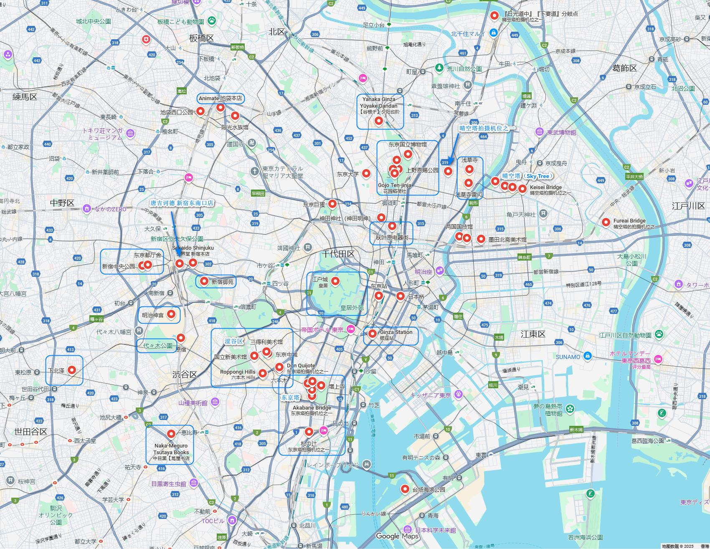

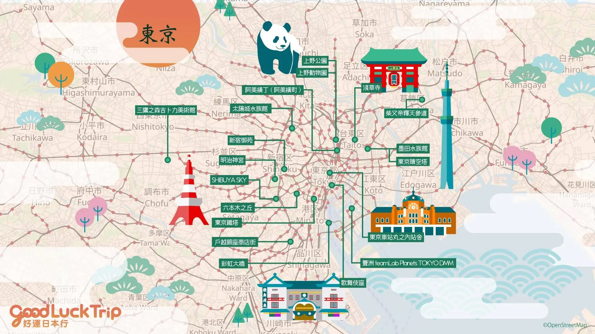

东京，旧名江户（即“河口”之意，起源于隅田川流入当时称为“江户内海”的东京湾）。

1603年，**德川家康**打败众多其它大名，完成日本的大一统，在**江户**建立城堡，创立江户**幕府**，开启了**江户时代**（德川家康成为日本的实际统治者，而当时的朝廷是丰臣政权，是丰臣秀吉的后代丰臣秀赖）。

1867年**大政奉还**（日本江户幕府的第十五代将军德川庆喜将政权还给了明治天皇，这一事件标志着持续264年的江户幕府统治结束）后，政治权力回到了天皇手上，也开启了明治维新。**都城**也随之从京都**迁至江户**，并改称为东京。

1923年关东大地震、二战期间大范围遭受美国空袭，曾让东京遭遇两次毁灭性的破坏，但随后却也都迅速进行重建工作，凭借在重建过程中充分考虑东京在震灾前就有的问题、灾后土地的收购顺利等因素，东京经济迅速恢复，目前已发展成为最现代化的城市之一。

东京的GDP为全球第二，在2016年达9,730亿美元，而同时东京都会区（一都三县）则高达1.8万亿美元，若将东京视为一个国家，其GDP总量高于加拿大、韩国、俄罗斯等，位列世界第八。东京为亚洲最重要的世界级城市之一，也是传统上的**全球四大世界级城市**（伦敦、纽约、巴黎、东京）之一。

东京于1964年、2020年共两次举办奥运会，也是目前第一个两次主办奥运会的亚洲城市。

## 1.1 路线

## 港区

### 东京铁塔

东京塔，正式名称为日本电波塔，建于1958年。高332.9米，是日本第二高的建筑。东京塔外形模仿巴黎埃菲尔铁塔建造，塔身间隔涂装白色和红色。

**拍摄机位建议**

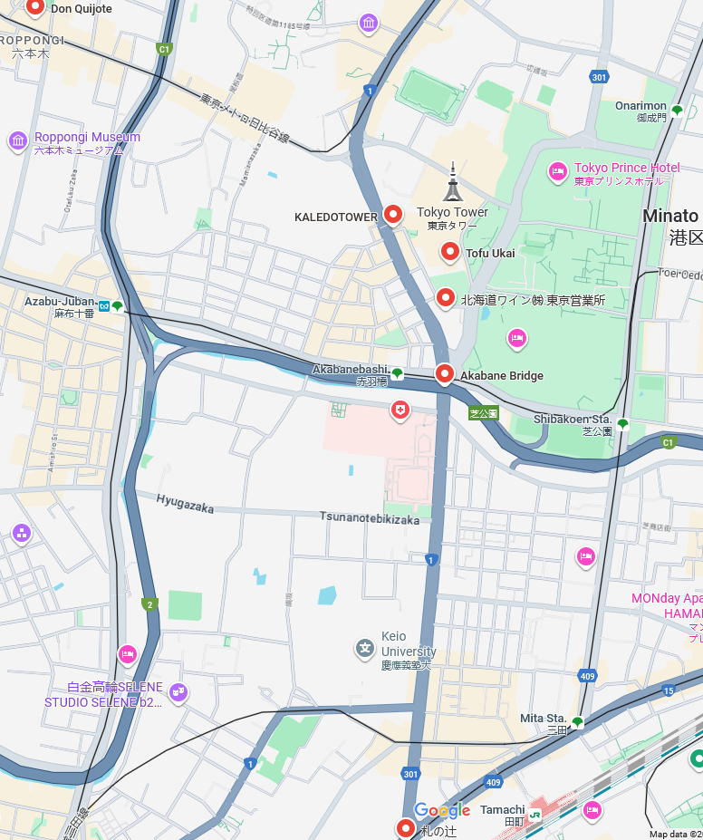

- Tofu Ukai 東京 芝 とうふ屋うかい 对面台阶下

	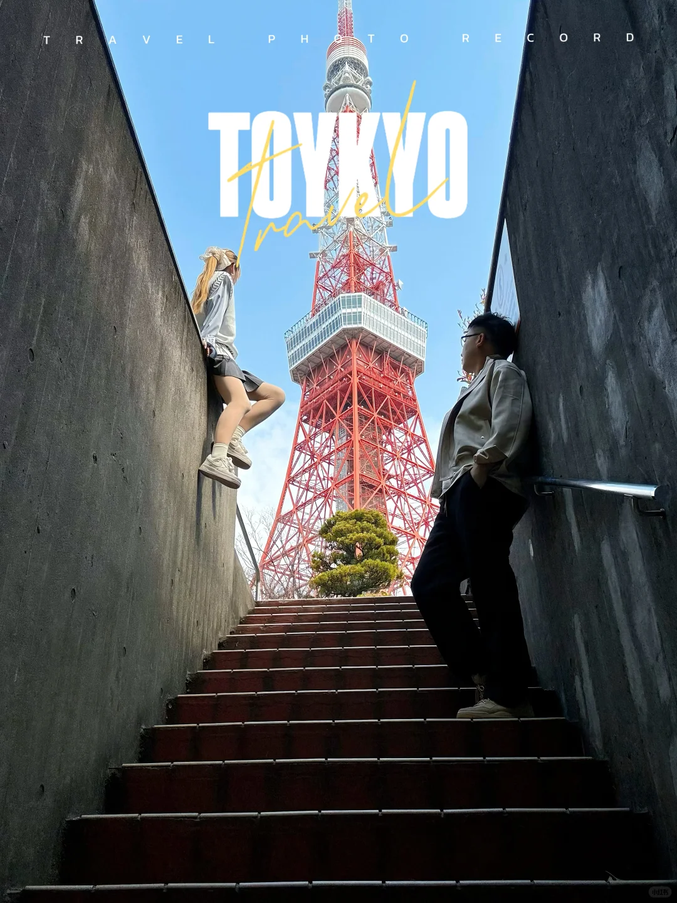
	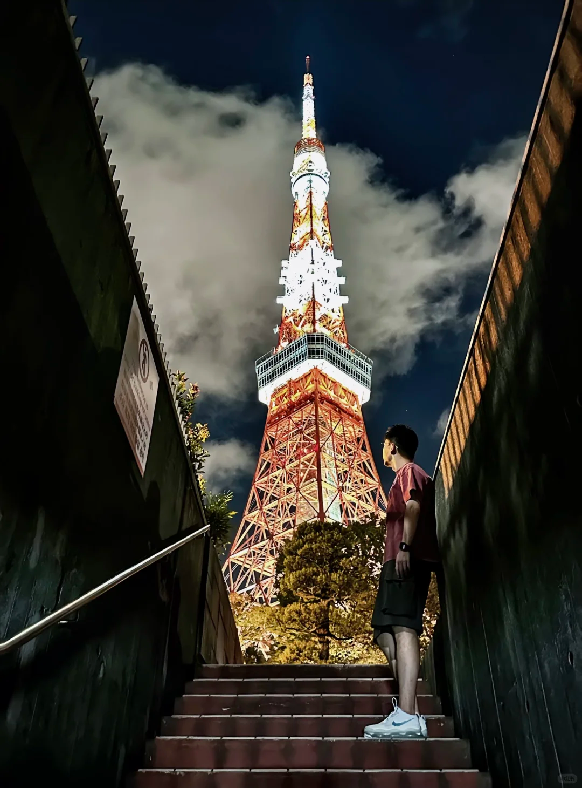

- 北海道ワイン㈱ 東京営業所 ----- Kaledo Tower（右图）

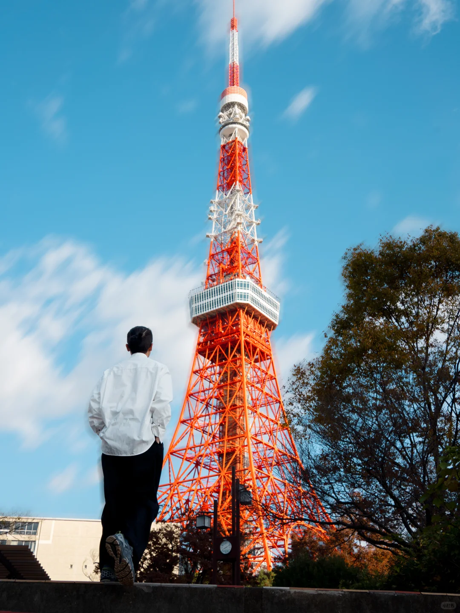

- 赤羽桥站E21出口（东京铁塔指示牌）

	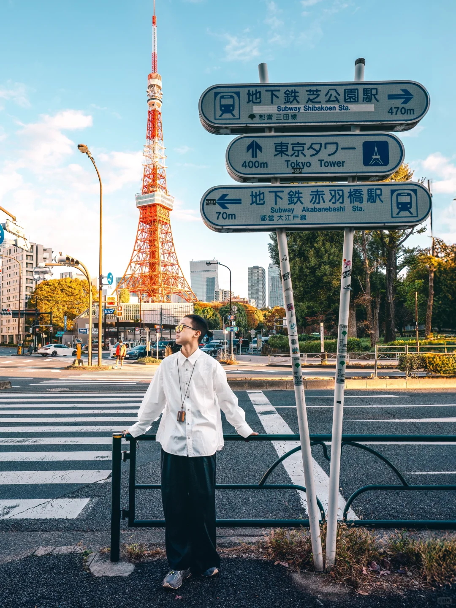
	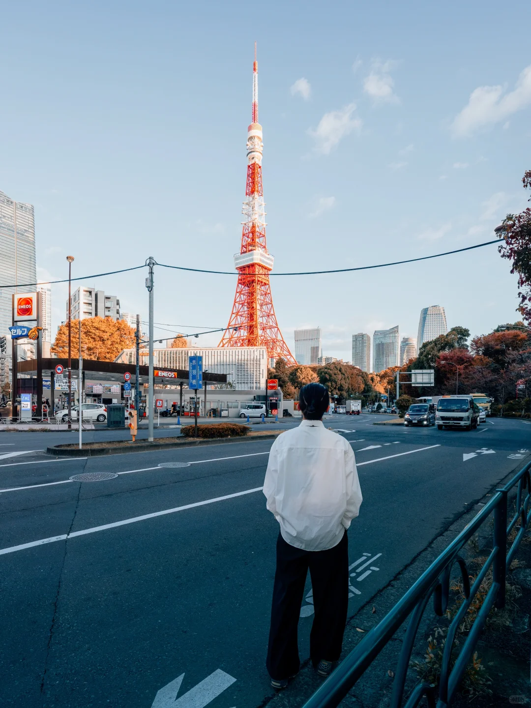

- 札の辻(三田站)（左图）---------六本木堂吉诃德（右图）

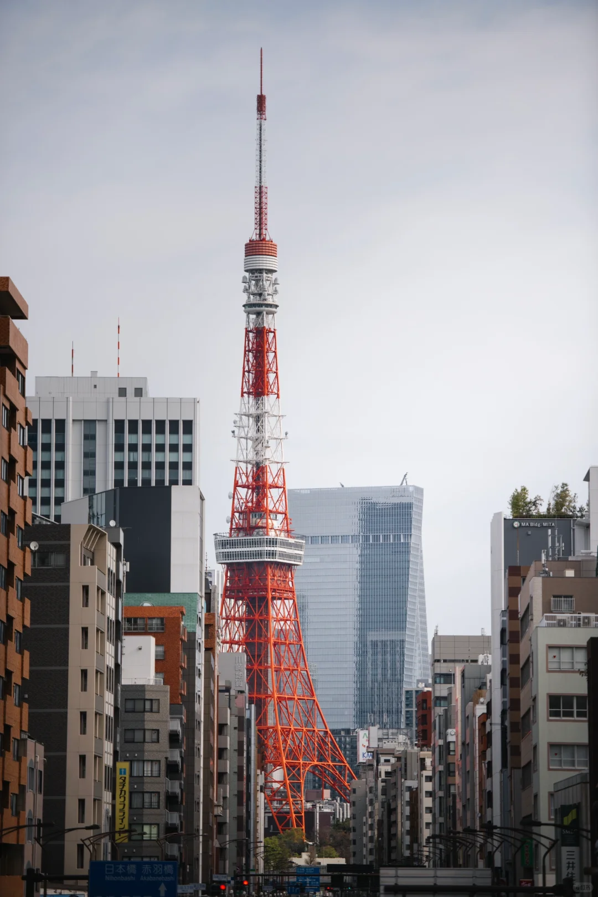
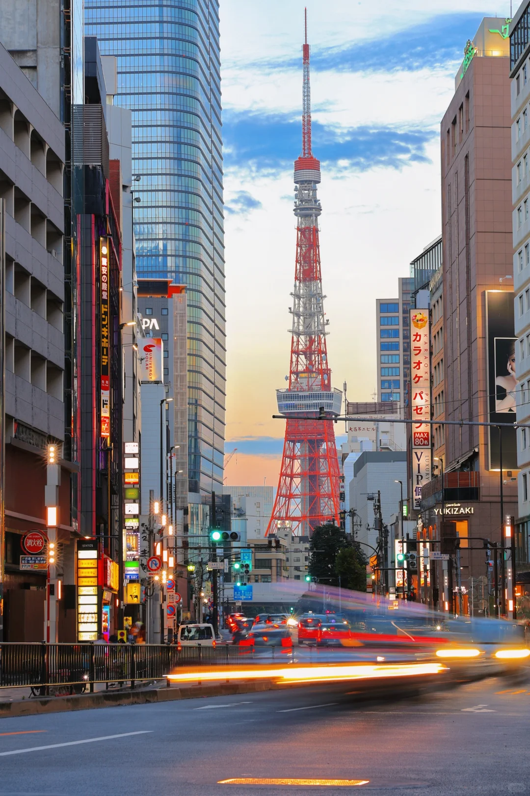

- 麻布台Hills观景平台33层

2024年11月的笔记，说无需预约也不花钱：
地址：Azabudai Hills Mori JP Tower(麻布台Hills）从1楼大门进去找到S2电梯上34楼（是的上34楼不是33楼）到达34楼后有个楼梯步行下到33楼即可开拍

**不建议入塔，看着一般**

**门票**

| 区域 | 成人票价 |
| - | - |
| MAIN DECK（150m） 即主观景台 | 1500日元（约72.24人民币）                                                    |
| TOP DECK Tour (150m & 250m) 顶层观景台 | 网上购票3300日元（约158.93人民币） 柜台购票3500日元（约168.56人民币） |
| TOKYO DIAMOND TOUR(钻石之旅) | 7000日元（约337.12人民币）|

**FOOT TOWN**

共5层，1-3层都是商场、吃的，4、5是娱乐（例如攀岩）

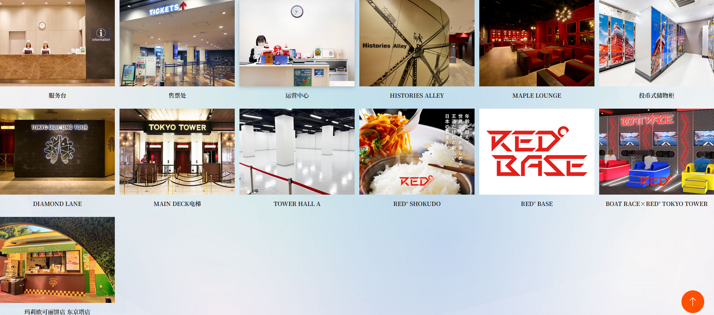
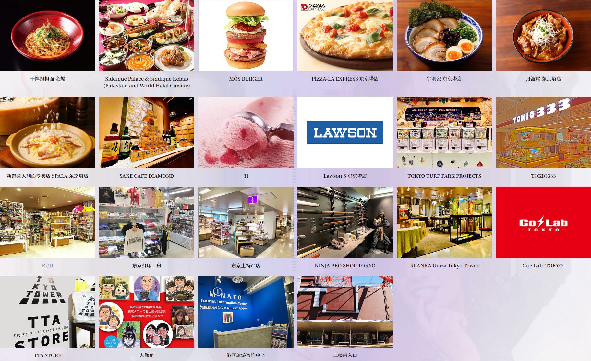

左为**MAIN DECK** ；右为**TOP DECK**

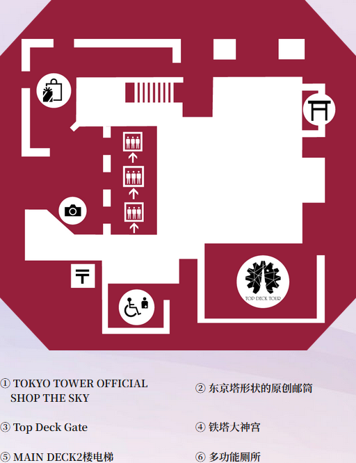

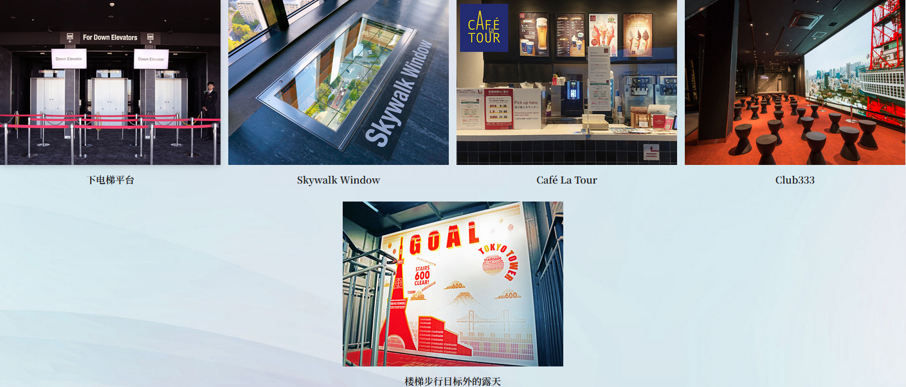
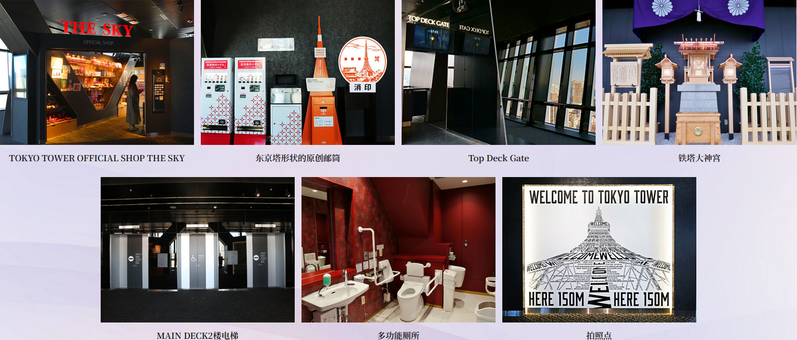

**钻石之旅**

需提前预约，1小时一批，参加者可以享受到头等舱贵宾待遇：在专属豪华休息室休息，通过专用通道和专属电梯前往顶层观景台；期间同行的表演者会以唱歌和表演等方式，为观景之行增添更多乐趣。

### 增上寺

东京塔脚下是一大片的墓地，是德川家族的墓地，其中包含第六代、第七代等六位将军，而这片墓地属于增上寺

### 台场（导航【台场海滨公园】）

- 人工岛，如果从市区出发，需乘坐百合鸥号（Yurikamome）至“台场海滨公园”站
- 彩虹大桥

- 台场海滨公园
东京唯一开放的白沙海滩区，不允许游泳但有多种水上项目，但也有让人迷惑的景象-一尊自由女神像的复制品

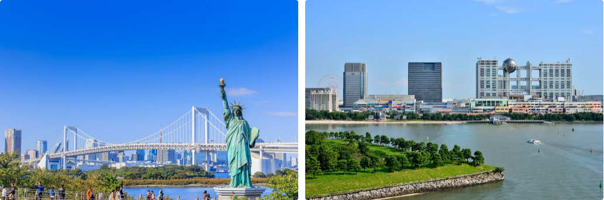

- 两大购物商城 Aqua City 和 DiverCity
- 充满未来气息的景点和博物馆，**需票**：索尼探梦科技馆、东京杜莎夫人蜡像馆、潮风公园、日本科学未来馆、海事博物馆、大江戶温泉物语御台场店、幻视艺术博物馆、东京都虹之下水道馆、富士电视台本社大楼、松下中心、东京国际展示场和台场怪奇学校。

## 墨田区

### 东京晴空塔

因城市发展，东京塔的高度不再满足这座巨大城市对信号发射塔的需求。东京决定再建造一座更高的塔。

[东京晴空塔](https://www.tokyo-skytree.jp/)，也叫做“**天空树**”，2008年7月开工，竣工于2012年，高度634米，是东京目前的广播电视塔，也是目前为止全世界最高广播电视塔（比广州塔高34米）。（是世界第二高建筑，仅次于迪拜哈利法塔（828米））

**营业时间**
9:00 - 22:00

**门票**
有一个微信公众号，还有[晴空塔官网](https://www.tokyo-skytree.jp/cn_t/ticket/individual/)，两个平台报价不一致（也有可能是因为我在微信公众号里没点到详情里）

- 提前一天购买预售票即可；
- 预售票有两个门票价格，是因为工作日和节假日的区别

| 入场券 | 区域                                   | 价格                                       |
| ------ | -------------------------------------- | ------------------------------------------ |
| 预售票 | 天望回廊（450m）+ 天望甲板（350m）套票 | 3100或3400日元（约150.25或164.79元人民币） |
| 预售票 | 天望甲板（350m）套票                   | 2100或2300日元（约101.78或111.48元人民币） |
| 当日票 | 天望回廊（450m）+ 天望甲板（350m）     | 3500或3800日元（约169.64或184.18元人民币） |
| 当日票 | 天望甲板（350m）                       | 2400或2600日元（约116.32或126.02元人民币） |

**拍摄机位概览**

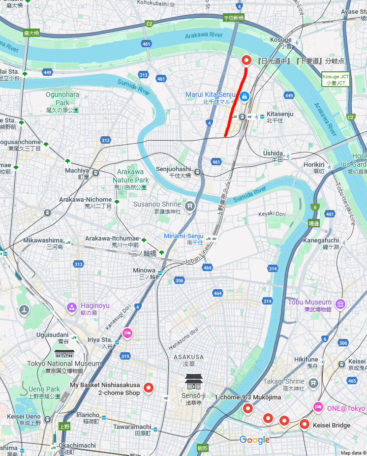

- 押上京成桥 --------------------- 向島１丁目９−3

- 第３東武館 --------------------- 足立区日光街道

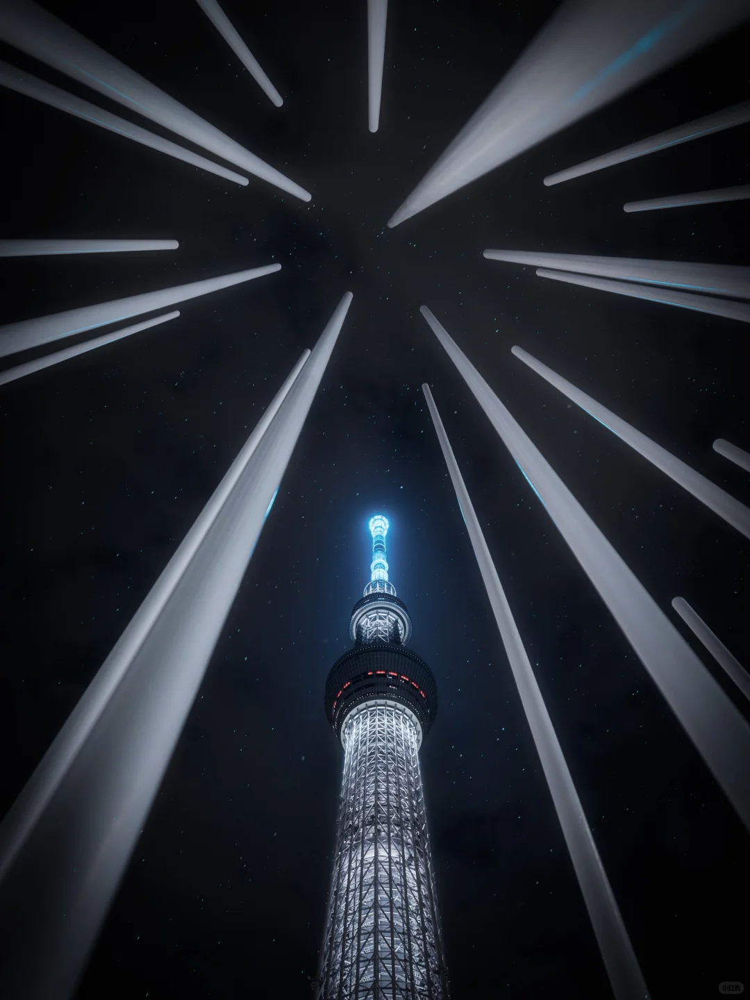

- ふれあい橋 --- まいばすけっと 西浅草２丁目店（浅草寺旁）

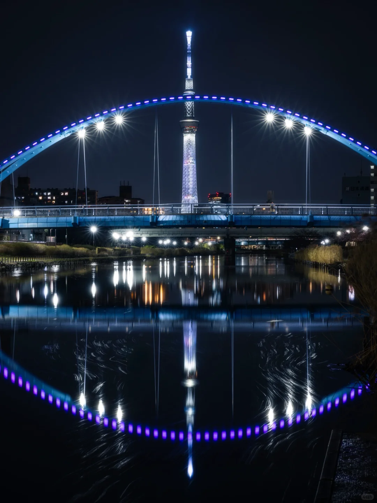

- 東日本橋２丁目２０−3（需要超长焦）

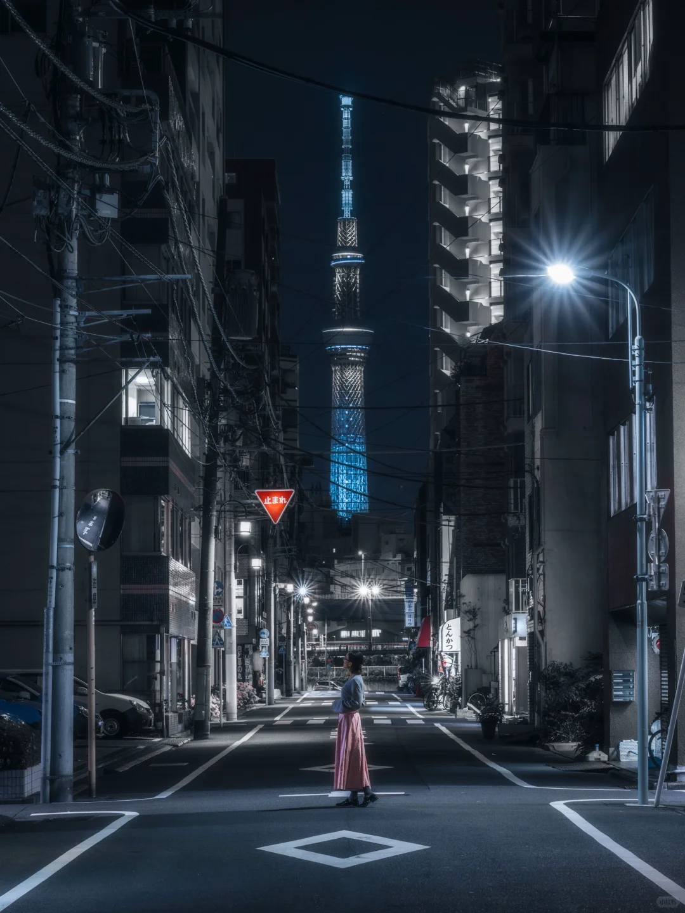

### 两国

因日本国民运动相扑而闻名，这里也有许多奇妙的博物馆、园林和传统购物街。

- **两国国技馆**，是当地的一处地标建筑，附近有很多相扑场和供应相扑火锅的餐厅。相扑火锅是一道美味、丰盛又健康的佳肴，也是相扑选手饮食的重要组成部分。在每年的一月、五月和九月会举办共三场全国性比赛；体育场内设有**相扑博物馆**，该馆在非比赛日免费开放，馆内陈列着大量与相扑有关的物品，这些物品每年更换六次。

- 江户东京博物馆

- 墨田北斋美术馆

- 东京都现代美术馆

- 清澄庭园

## 台东区

### 上野恩赐公园

[上野恩赐公园](https://www.kensetsu.metro.tokyo.lg.jp/jimusho/toubuk/ueno)是日本第一座公园，每年大约会有1200棵樱花树开花。秋天可以观赏枫叶。到了冬天，在占地区域内的上野东照宫，会开放欣赏新年的吉利之花”冬牡丹”。[参考景点攻略](https://www.bring-you.info/zh-hans/ueno-park-maple)

	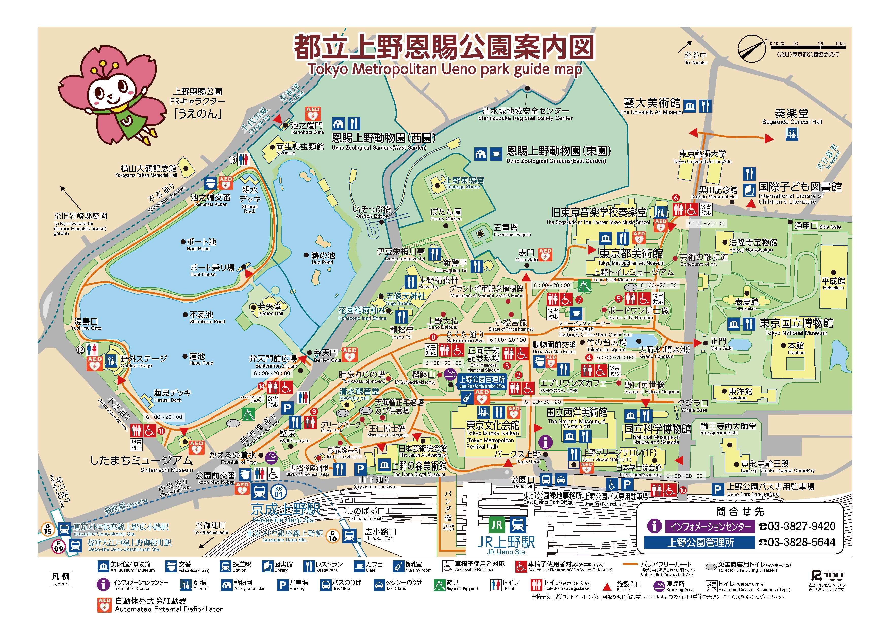

**上野公园散步路线**：JR上野站 → 西乡隆盛雕像、清水观音堂 → 花园稻荷神社 → 上野大佛 → 上野东照宫 → 上野动物园 → 东京都美术馆逛 → 阿美横町步行 → atre上野、ecute上野

**清水观音堂**（Kiyomizu Hall）是以京都清水寺为灵感而建造的

	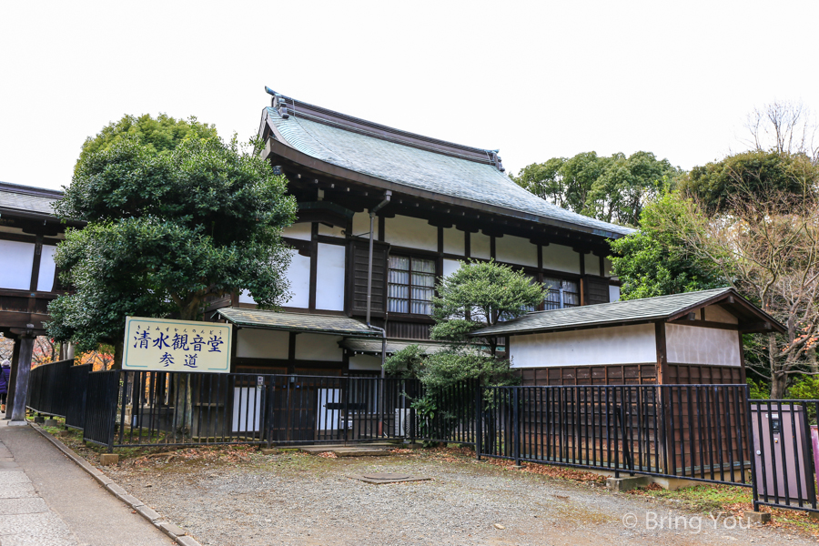

#### 花园稻荷神社

**花园稻荷神社**（Hanazono Inari Shrine），迷你版的伏见稻荷大社千本鸟居，位于上野恩赐公园中

	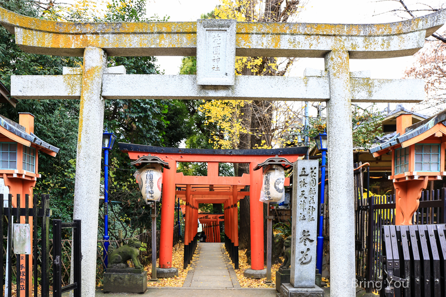

#### 上野大佛

**上野大佛**（Ueno Daibutu），释迦如来坐像大佛，由于多灾多难到最后只剩下脸部「不落地」。与日语「不落第」（即不会落榜）发音相同，因此吸引日本考生前来祈求考试顺利。

	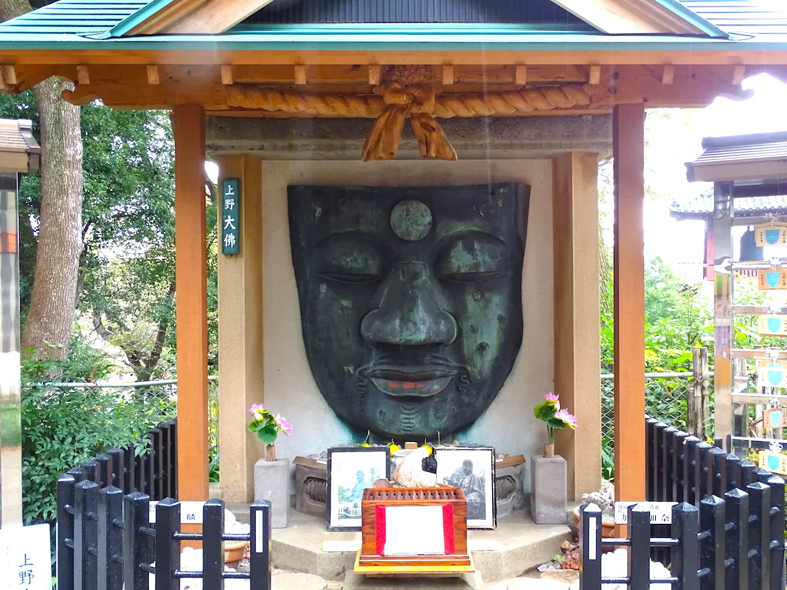

#### 东京都美术馆

免费

	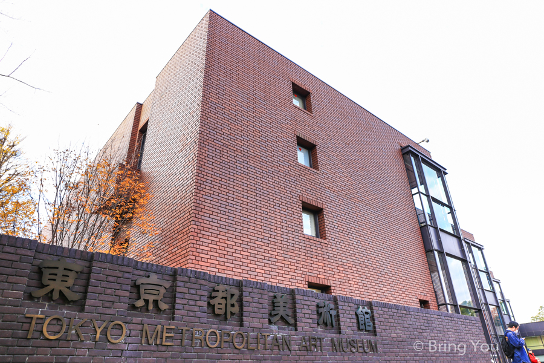

#### 东京国立博物馆

收藏了约 12 万件作品，其中 89 件是国宝，650 件是日本的重要文化财产，包括主馆本身（下为**主馆**图）

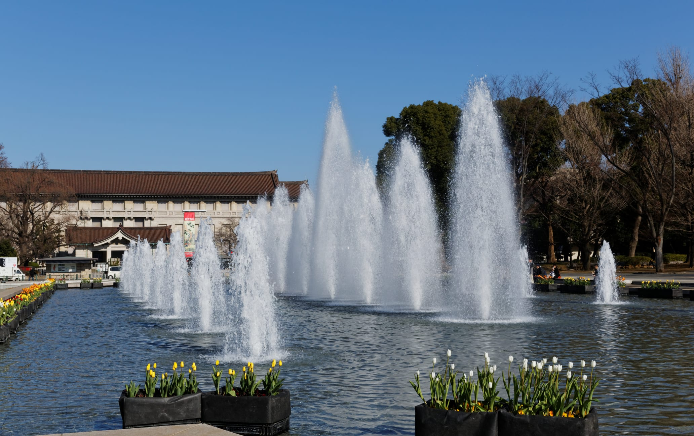

**东洋馆**（亚洲文物），这里展出中国・朝鲜半岛・东南亚・西域・印度・埃及等国家和地区的工艺美术品和考古文物

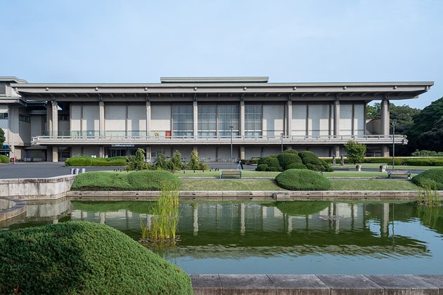

**平成馆**（特展·日本考古）

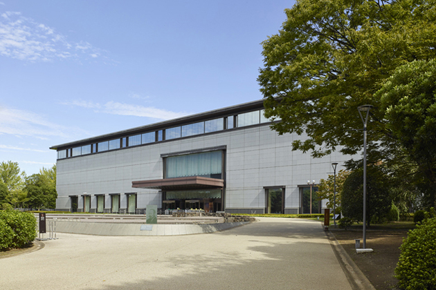

**表庆馆**，为纪念后来继承皇位的大正天皇成婚，由建筑设计师片山东熊设计，1909年建成开放。本馆是明治末期西洋风格的代表建筑，1978年被指定为国家的“重要文化财”。仅在举办特展及其他活动时开馆。

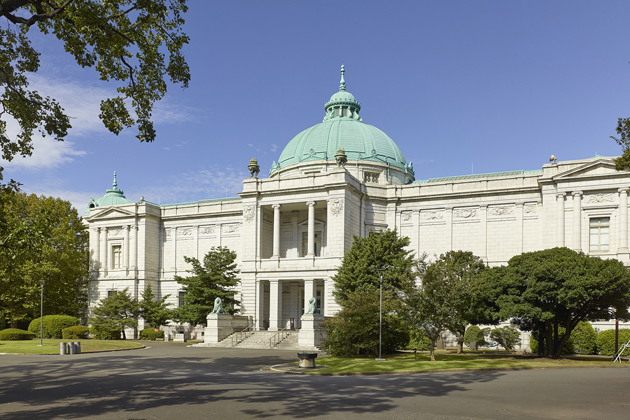

**法隆寺宝物馆**（法隆寺献纳宝物），这里收藏有奈良法隆寺于明治11年（1878）捐献给皇室的约300件宝物。一楼有餐厅。现在的建筑1999年建成开馆，由建筑设计师谷口吉生设计。

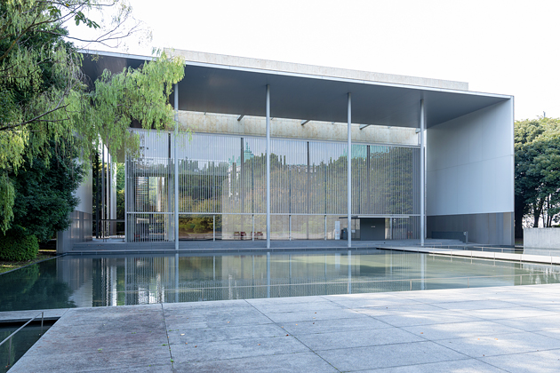

**黑田纪念馆**，遵照西洋画家黑田清辉的遗愿，于1928年建成竣工。建筑由冈田信一郎设计。黑田纪念室和代表作品展室展览黑田清辉的作品。免费参观。

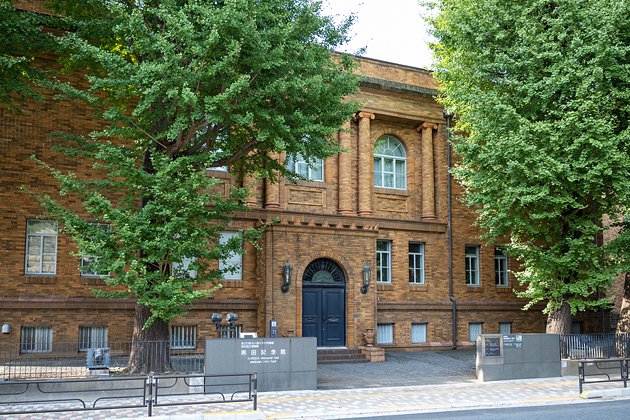

**开馆时间**
9:30-17:00
每星期五、星期六、次日星期一为法定节假日的星期日，20：00闭馆
（注）入馆时间截止到闭馆前30分钟
（注）根据时期会有所变动

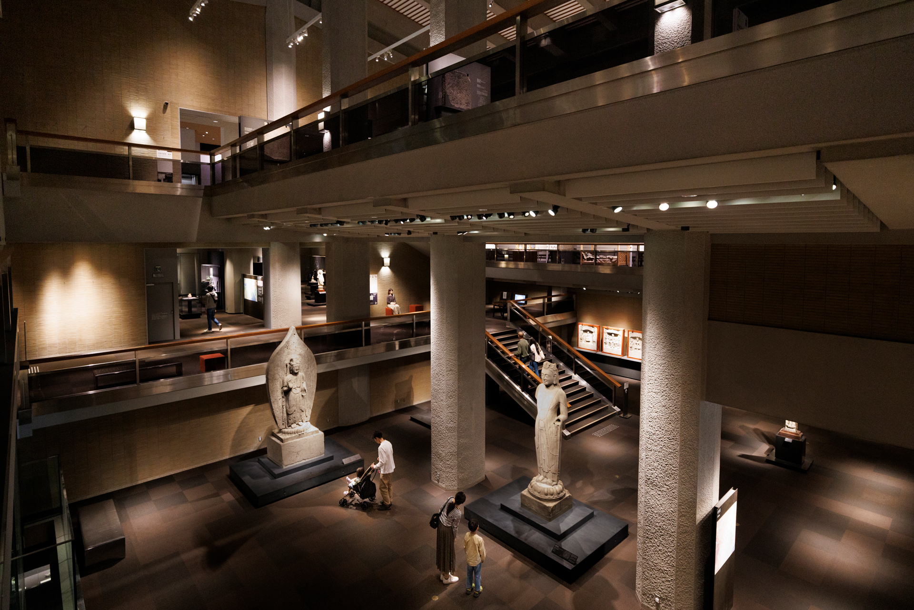

**闭馆日**
星期一（如逢法定节假日则开馆，翌日闭馆）、年末年初

（注）2025年4月28日（星期一）、8月16日（星期二）、9月22日（星期一）、2026年3月30日（星期一）开馆。9月22日（星期一），仅主馆、平成馆、法隆寺宝物馆开馆。
（注）2025年12月16日（星期二）为检修设备而闭馆。
（注）2025年12月22日（星期一）至2026年1月1日（星期四）12：59
（注）2025年年末开馆至12月21日（星期日），2026年年初于1月1日（星期四）13：00开馆
（注）详情请查看[参观指南](https://www.tnm.jp/modules/r_free_page/index.php?id=113)页面。

**票价**

| 类别 | 价格 | 备注 |
| - | - | - |
| 特展 | | |
| 东博典藏文物展[购买东博典藏文物展门票](https://www.asoview.com/channel/ticket/WuX1M0a3sG/ticket0000027926/) | 成人 1000日元/人（约46.31人民币） | 需提前预约，无需指定日期时段。自购买时日起2个月内有效。 |
| 黑田纪念馆 | 免费 | |
| 资料馆 | 免费 | |

#### 梅川亭

往上野动物园方向走，会路过的「梅川亭」

### 浅草寺

**无需门票，与晴空塔、秋叶原相近**

东京最古老的寺院。江户时代的初期，由德川家康公决定幕府的祈福所之后，堂塔的威容更进一步完善，作为江户文化的中心繁荣起来。

主佛是圣观世音菩萨。观音有11面、1000手、如意轮等各种姿态，圣观音是其基本。

浅草寺在二战期间被炸毁，于1960年重建。

	

**正殿（观音堂**）
1958年，在全国信徒的帮助下重建的现本堂是1945年3月10日在战灾中烧毁的旧本堂(国宝，德川家光建立)相同形态。 屋顶的斜坡非常陡，其特点是与其他寺院相比，楼高得多。佛堂面向南方，分为内阵和外阵，内阵中心有供奉主佛观世音菩萨的御宫殿。

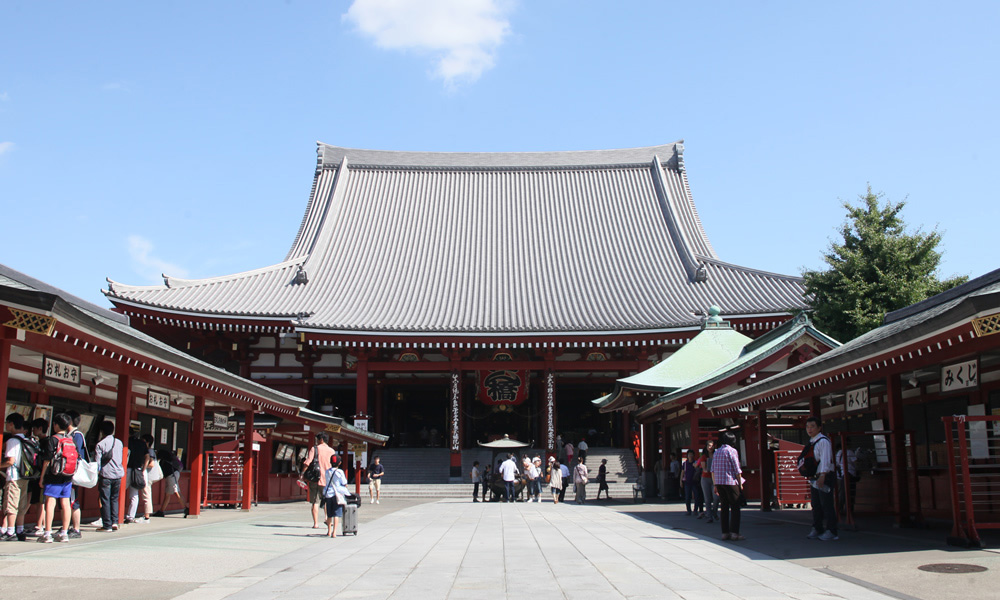

**影向堂（御朱印所）**
对于观音的说法和活跃表现，赞颂合作的佛法被称为”影子向众”。 供奉着作为每个人的出生年守本尊的8尊佛。这里授予浅草寺的御朱印。

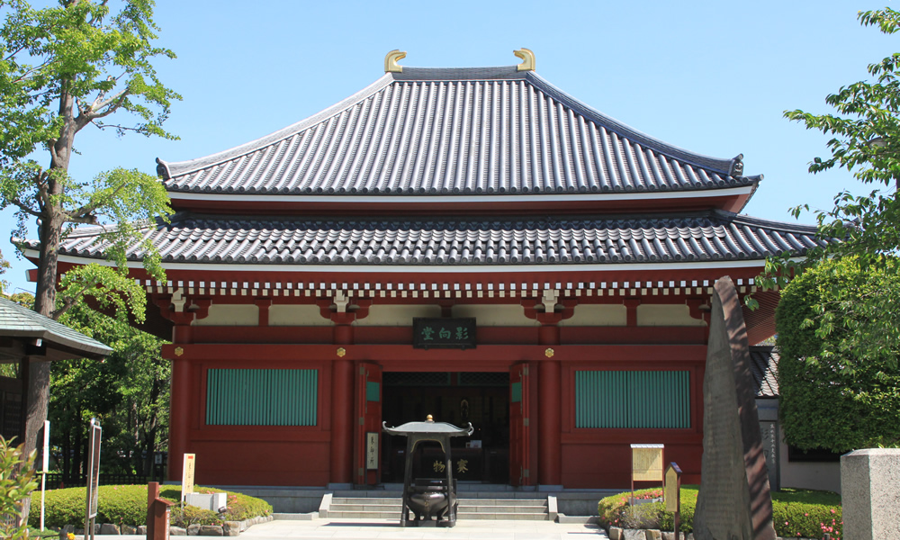

**淡岛堂**
于元禄年间(1688至1704年)请来和歌山加太的淡岛明神，建立佛堂。 中尊有阿弥陀如来像，两侧坛保护淡岛明神和虚空藏菩萨。 这个寺院在战后不久就是临时正殿，1994年通过曵屋作业迁移到现在的所在地，直到今天。

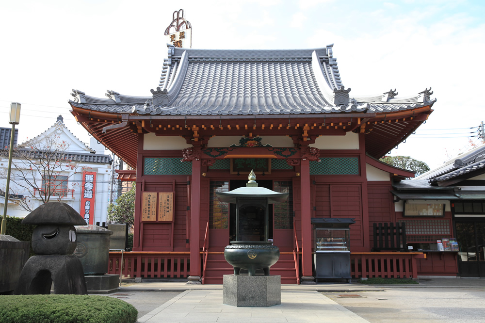

**五重塔**
天庆5年(942年)由陈平公雅创建。德川家光建造的旧国宝五重塔因1945年3月10日的战火而被烧毁。得到各位信徒的帮助，从斯里兰卡的王立寺劝佛舍利，于1973年重建。

**传法院**
浅草寺本坊・传法院是”客殿”、”大玄关”、大小的”书院”和贯颈大僧正的”御宅”等的总称。殿是当山的回向道场・修行道场。庭园是江户初期的小堀远州作的传话式庭园(非公开)

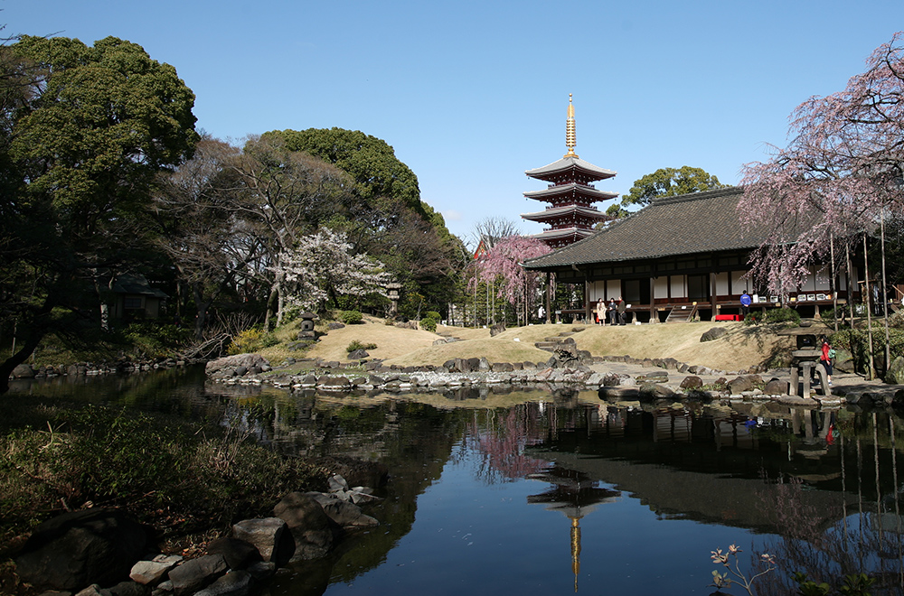

**二天门**
创建于元和4年。当初是位于寺院内的东照宫的随身门，现在的门是于庆安2年(1649年)重建的浅草寺的东门。经过平成的修复，恢复了当初建立时的面貌。 其名字来源于祭祀增长天·持国天的2天。

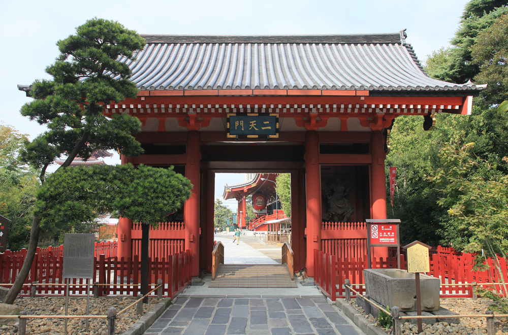

宝藏门（旧称仁王门）
天庆5年(942年)由陈平公雅创建的山门。由德川家光进行迦藍的捐赠建立，仁王门是庆安2年的落庆。现在的大门由大谷重工业酒店新大谷创始人大谷米太郎先生的捐赠于1964年重建

雷门（风雷神门）
天庆5年(942年)由陈平公雅创建的浅草寺的正门。 供奉着风神和雷神这2位神仙，是为了守护伽蓝和防止风灾与水灾而除難的一种护法善神。现在的门代替了庆应元年(1865年)田原町大火而烧毁的门，1960年，时隔95年，由**松下电器**创始人松下幸之助**捐赠**重建而成。

仲见世通
是日本最古老的商业街之一，销售传统的玩具和点心等特产。

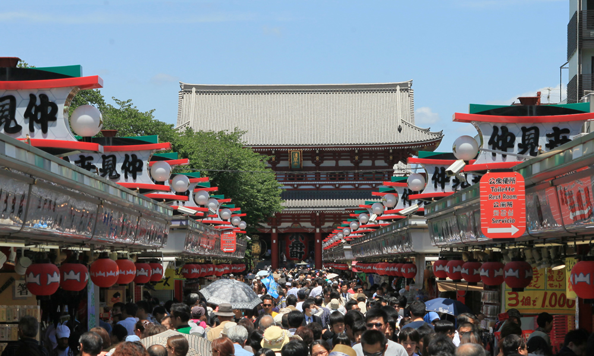

弁天堂
本尊是白发的老女在天，作为”关东3弁天”的灵名也很高。院内钟楼钟由元禄5年(1692年)德川纲吉命改铸而成。江户时代的”时之钟”之一，松尾芭蕉的短语”花之云是在上野或是浅草”而闻名的钟声。

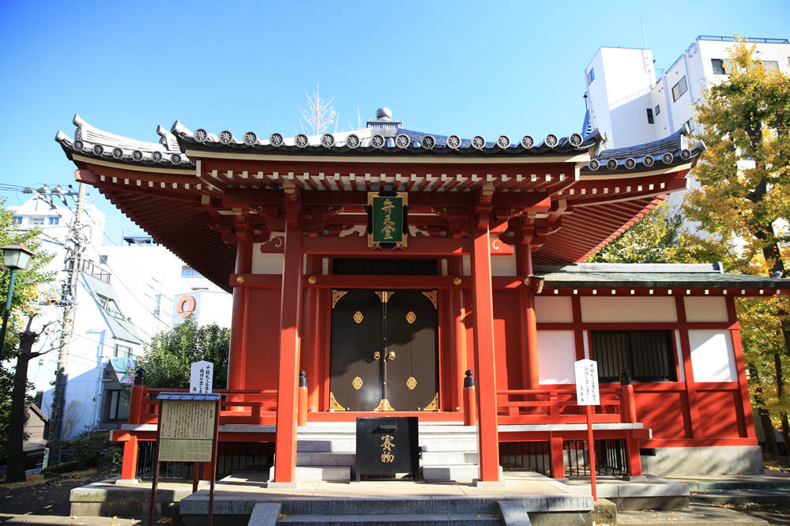

## 文京区

### 东京巨蛋/东京巨蛋城

东京巨蛋城是一片区域（公园免门票，内部设施单独收费）
包含：

- 东京巨蛋
- Tokyo Dome City Attractions（游乐园）
- LaQua（综合商业设施）/聚变商业设施

  * 东京巨蛋天然温泉 Spa LaQua（温泉水疗会馆）
  * Sauna Lounge Rentola
  * LaQua(综合商业设施) 商店 & 餐厅
  * 东京巨蛋 健身房
- 东京巨蛋饭店
- 日本棒球名人堂
- 保龄球馆
- 旱冰场
- 美食城
- WINS 后乐园
  等

	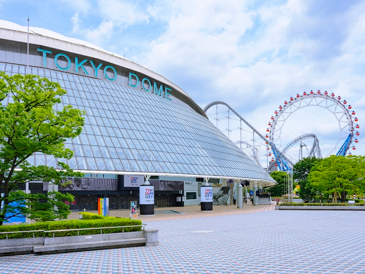
	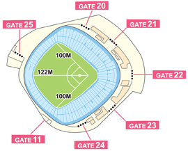

#### 1. 东京巨蛋

东京巨蛋是一个空气支撑的圆顶，利用气压差支撑屋顶膜。加压风扇使穹顶内部的气压比外部高0.3%，以支撑屋顶膜。

东京巨蛋是日本职棒球队【读卖巨人】的主场，除了棒球，也曾经举办过篮球与美式橄榄球比赛，还有职业摔跤、综合武术、K-1赛事或音乐表演【**包括2018年 Taylor Swift 的 Reputation 演唱会**】等。

东京巨蛋亦为日本“五大巨蛋”之一，其他4者为福冈巨蛋、札幌巨蛋、名古屋巨蛋、大阪巨蛋，

**TOKYO DOME TOUR**

| 开放时间 | ① 8:15-9:15 (受理时间:8:00-8:15、所需时间60分钟)` `② 9:45-10:45 (受理时间:9:30-9:45、所需时间60分钟)` `③ 10:30-11:30 (受理时间:10:15-10:30、所需时间60分钟)8:15-9:15只举行运动课程 |
| -------- | ----------------------------------------------------------------------------------------------------------------------------------------------------------------------------------------------- |
| 票价     | 成人（高中生以上）3,500日元（约162.96人民币）` `儿童3,000日元 ` `**周六、周日和节日，8月举办日比上述费用+500日元(约23.28人民币)**                                               |

**TOKYO DOME TOUR 行程**

- 运动套餐 (仅8:15~9:15的时间段举行)
  可以在选手玩的土墩或候补投手踏板上体验投球和挥杆。（投手板或投球练习场将根据场上情况而定。)
- 标准行程
  去选手比赛的球场、长椅、小组座位等。在运动场上，可以和只有在TOKYO DOME TOUR上展示的单品等一起，尽情享受拍照留念的乐趣
- VIP区和后院球场
  为您介绍年度合同的VIP房间、团体座位、3垒旁的候补投手练习场、后院等通常很难进入的区域等。
  (不去运动场)
- 艺术家后院球场
  我们将引导您前往通常禁止进入的区域，例如音乐会艺术家使用的等候室和后台区域。您可以在艺术家实际使用的空间中欣赏音乐会的余韵。
  (不去运动场)

#### 2. 东京巨蛋天然温泉 Spa LaQua（温泉水疗会馆） & Tokyo Dome Hotel

天然温泉，桑拿，美容和身体护理等各种放松设施，餐饮店也很齐全的温泉浴设施

票价：成人（高中生以上）3,500日元（约**162.96人民币**）
深夜加收费用（深夜1:00～清晨6:00 住宿的客人）2,500日元（约**116.40人民币**）

	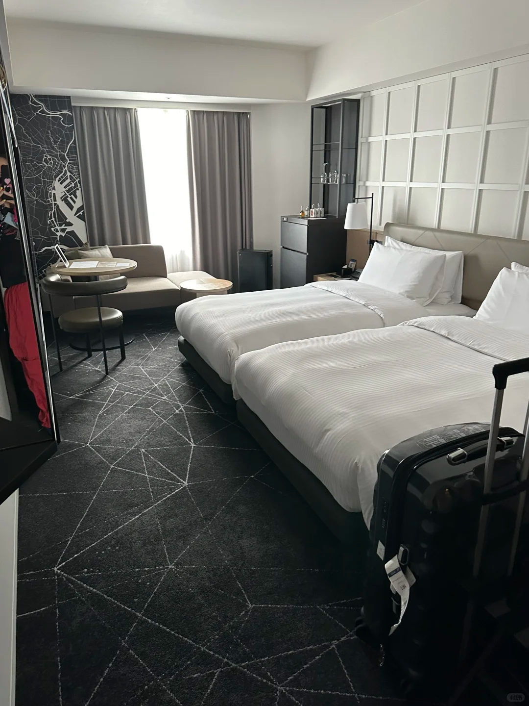
	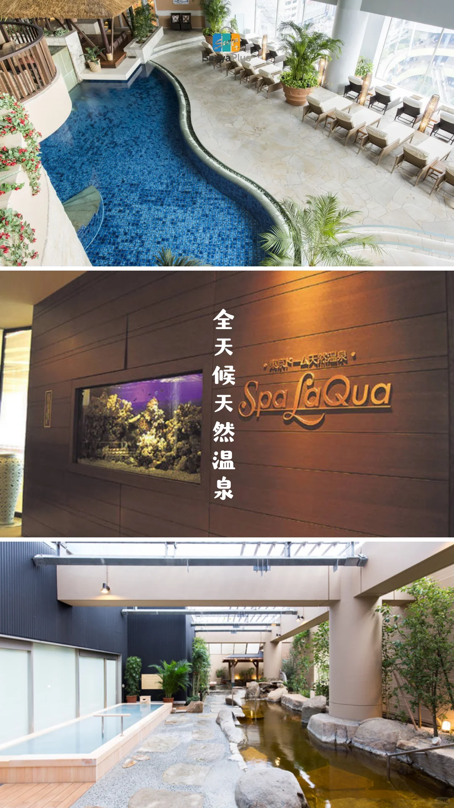

## 中央区

### 滨离宫恩赐庭园

[官网](https://www.tokyo-park.or.jp/park/hama-rikyu/)

**门票**
300円（约**13.97人民币**）

**营业时间**
9:00 - 17:00

**简介**
滨离宫恩赐庭园在江户时代被称为「滨御殿」，是德川幕府将军的别庄，后来成为日本皇室的离宫。 1945年被指定为东京的都立庭园，并对民众开放。占地25万㎡（北京玉渊潭公园是132.38万㎡，陶然亭公园的面积是56.56万㎡）

**亮点**

- 庭园的中央水池潮入之池并非一个简单的水池。潮入之池的日语名称 (Shioiri) 意为"潮池"，它的池水实际上是**来自东京湾的海水**。人们根据潮汐的涨落用水闸控制水位，因此池中的水一天之内都会有变化
- 中岛御茶屋的抹茶和传统甜点
- 在连接庭园各个岛屿的桥上（长 120 米）漫步
- 猎鸭场，曾为幕府将军所用，还有一座纪念碑，祭慰庭园内成为猎物的猎鸭的灵魂

### 银座与日本桥

银座，城市中央区的商业街区

“日本桥”建造于德川家康在江户创立幕府那年（1603年），这座桥中间埋着“日本道路起点标记”，一如这里曾是江户时代的五街道起点，“日本桥”正是现代日本道路的起点

### 歌舞伎座

位于银座，是日本歌舞伎剧院中的最高殿堂，可容纳约2000名观众。

## 千代田区

### 秋叶原

秋叶原指的是东京【千代田区秋叶原站】的周边地区。涵盖东京【都千代田区外神田】、【神田作马町】和东京【都台东区秋叶原】一带。作为动漫、电子游戏和女仆等日本次文化的圣地而知名。江户时代，该地区曾作为【宿场町和重要的物资集散地】而繁荣兴盛。

	
	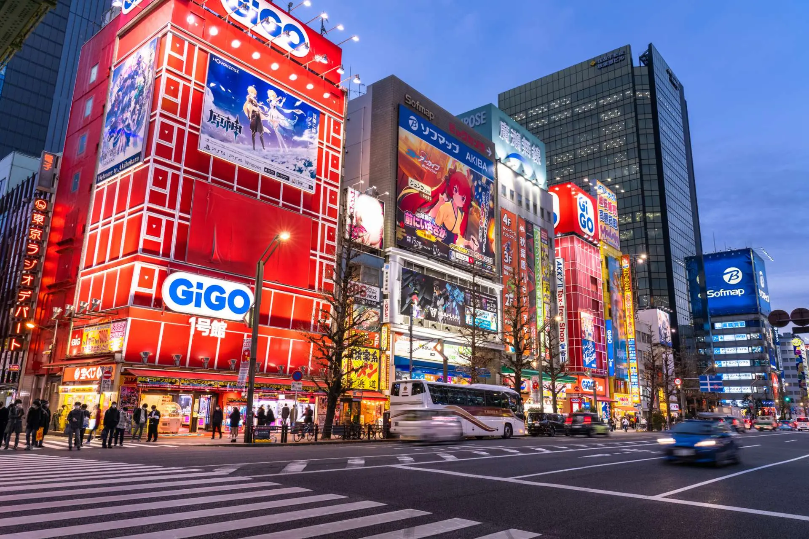

#### 神田神舍

因举办同为日本三大祭和江户三大祭之一的「神田祭」而闻名。
据说对结良缘、保佑商业兴隆及消灾除厄都特别灵验，还是胜负运的守护神。在这里可以买到很多和动漫相关的绘马、御守及各种周边商品。

	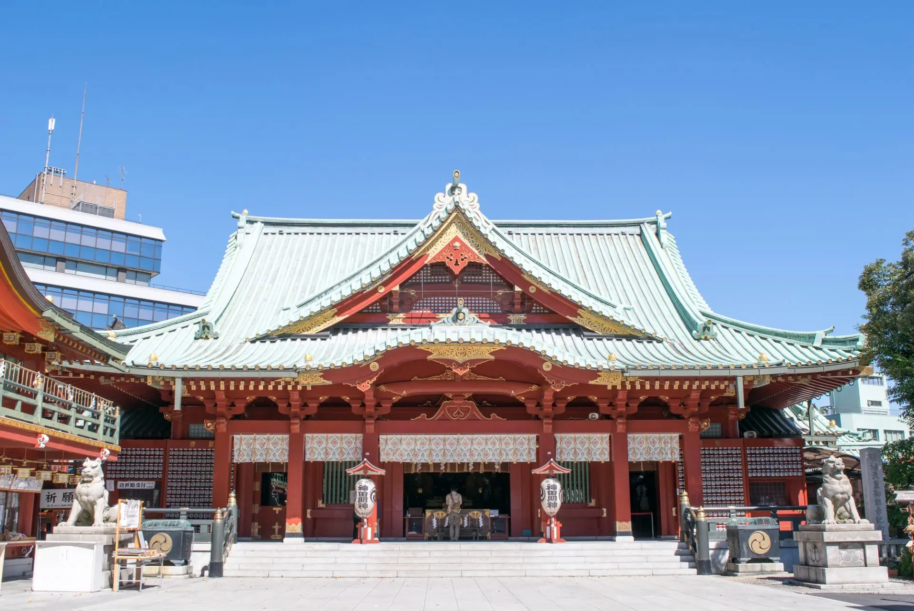

#### 电器街

集结了大型店家和大小各种型态的电气店，是日本最具代表性的电器街，以「AKIBA」昵称而闻名

	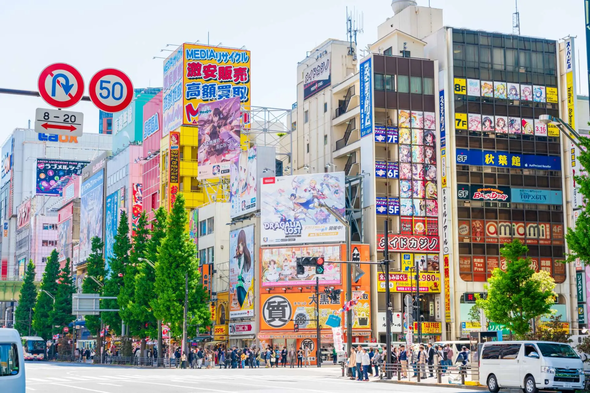

#### 无线电会馆

自1950年开幕以来，长年来一直都是秋叶原站前远近驰名的地标。
地上10层楼、地下2层楼的大楼里，集结了超过30家兴趣嗜好、动画、漫画、游戏、模型公仔，和秋叶原规模最大的集换式卡片等秋叶原文化的专卖店，还有Beer Hall和便利商店。

	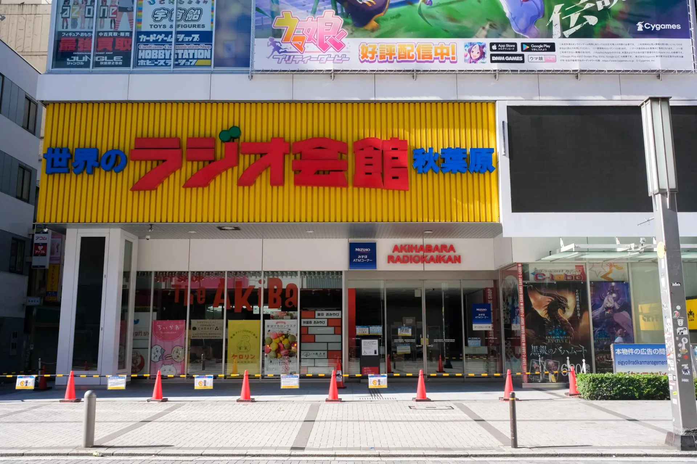

### 皇居

免费参观，可[预约](https://sankan.kunaicho.go.jp/multilingual/lang/tw/information.html)（200人次），也可现场报名（300人次）

占地面积**17万㎡**（故宫是72万㎡），约逛1小时

**冬天**前往东京旅游，则可安排在 1 月 2 日到皇居参观新年接见。皇居的大门会在特殊场合时打开，让游客进入内苑欣赏令人赞叹的美景，同时观看皇室家族接见臣民的情形。

**东京皇居的历史背景**

前身：江户城
东京皇居位于东京都千代田区，其前身是德川幕府的统治中心——江户城。**明治维新（1868年）**后，明治政府推翻幕府，将首都从京都迁至江户，并改名为“东京”，江户城随之成为天皇的新居所，即“皇居”。

从京都到东京的迁都
1868年，明治天皇发布《东京行幸诏书》，正式迁都东京。这一举动标志着政治权力从传统贵族和寺院聚集的京都，转移至现代化改革的中心东京。

皇居占了江户城的主要部分。皇居各处至今仍可见流露出江户城风情的城濠、土垒、石墙、箭楼、城门等。

二战期间曾被炸毁，重建后仍保留明治时代的布局。

	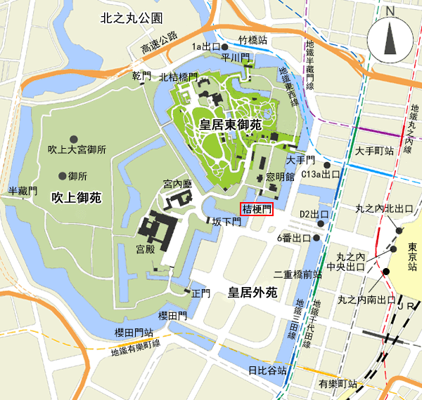

桔梗門 - 石垣 - 富士見櫓(富士望樓) - 宮內廳廳舍

	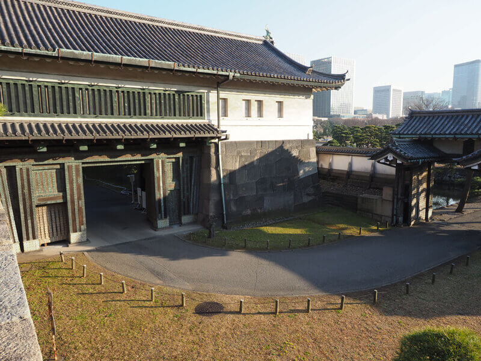
	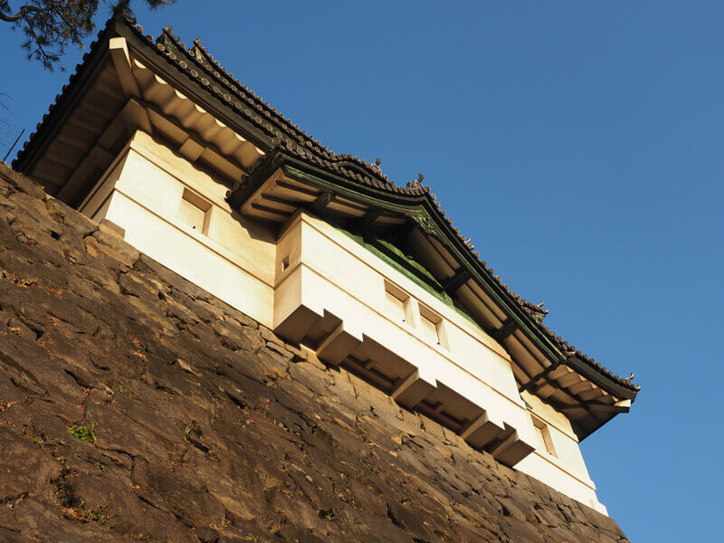
	
	

松塔 - 宫殿 - 南侧庭院 - 二重桥

	
	
	
	

伏見櫓望樓 - 北门口 - 山下街 - 莲池护城河

	
	
	
	

### 东京站

东京站（）被誉为日本各地的门户。该站于1908年3月动工，1914年12月正式启用，由日本近代建筑先驱**辰野金吾**设计。2003年被列为国家重要文化遗产。
站内共**4层**，南北两座穹顶高达**30米**。

	

#### GRANSTA 格兰思达

	

GRANSTA 是JR东日本规模最大的“Ekinaka（站内）”商业设施。由「格兰思达 东京」、「格兰思达 丸之内」、「格兰思达 八重北」，3大区域组成，是JR东日本最大规模的车站内商业设施。汇集了来自日本全国各地的精选商店、咖啡厅和餐厅。

[【GRANSTA（格兰思达）完整指南】必买必逛必吃25选一篇搞定！](https://www.gltjp.com/zh-hans/article/item/20156/)

##### 店铺：香炉庵KOURO-AN (格兰思达 东京)

「东京车站限定 东京铃最中」4个装 1100日元（约50.50人民币）（含税）

	

##### IRORI庵KIRAKU GRANSTA丸之內

炸牡蛎荞麦面

	

#### 三菱一号馆 美术馆

东京站旁边的【三菱一号馆 美术馆】，是日剧《半泽直树》银行的原型

	
	
	

## 丰岛区

### 池袋

[池袋景點地圖2025：34個池袋必去景點、住宿、美食推薦](https://tokyo.letsgojp.com/archives/679888/)

池袋，与新宿、涩谷并称为东京三大副中心，
以池袋站为中心，散布有主题乐园和休闲设施、大型购物设施、动漫相关的独立商店、代表东京的办公商务地区、餐饮店和住宿设施。

#### 乙女路 & Animate 池袋本店
在「阳光60通」西侧的通称「乙女路」上，有多家专门漫画、动画角色周边商品的商店以及Cosplay专卖店林立。特色是不少店家倾向「御宅族女性族群」即“宅女族”，这里可以说是“宅女天堂”，「**Animate 池袋本店**」也位于此。

	

#### 池袋西口公园

公园内设有宽11公尺、高3公尺的大型LED萤幕，和户外舞台的野外剧场「GLOBAL RING THEATRE」，可用于古典音乐演奏会、舞蹈、戏剧等各种节目的演出。

	
	

#### PARCO

池袋 PARCO 坐拥直通池袋站的精华地段，除了是普通的商场，还是能接触日本最新流行文化（如动画、漫画、游戏等）的热门景点

	

「吉伊卡哇拉面 豚」是以插画家 nagano的畅销作品《吉伊卡哇》中登场的「话题拉面店」为主题所打造。

	

#### Hareza池袋

2020年启用，利用旧丰岛区厅舍和旧丰岛公会堂旧址改建的大型复合设施，以动漫、艺术文化的传播地而广受瞩目。
以中池袋公园为中心，由设计风格统一的三栋建物组成，汇集有各种商店、Live剧场、动漫联名咖啡厅和活动中心。
3栋建物之间以名为连通桥的连络道路相连，从连络道路到入口、洗手间等，随处展示的各种艺术作品也值得一看。

	

#### 华人街
池袋地铁站西北口有华人聚集区（东西南部还有个横滨中华街）

### 阳光水族馆

门票价格：2600-3200日元（约120.38-148.16元人民币）

## 新宿区

[【新宿自由行完整指南】新宿必去必逛的好景點都在這了！](https://www.gltjp.com/zh-hant/article/item/20067/)

新宿，指的是以新宿站为中心的地区。新宿站西口的**西新宿**是日本少有的摩天大楼集中区，聚集了大量的企业总部和政府机关，东京都厅舍即位于此；另一方面，位于**新宿站东口**的新宿二丁目与大阪的堂山町并列为日本最大的同志村，歌舞伎町则是日本少数的大型红灯区。

新宿站，2007年获世界吉尼斯纪录——“世界上最繁忙车站”

### 东京都厅

	

**东京都厅**是日本东京都厅（东京都政府）及东京都议会的所在地，目前位于东京都新宿区，1991年正式启用，为新宿新都心最高的摩天大楼。

都厅大楼上层分为**南北两座塔**。每座塔的**45层**都有瞭望室。南展望室在晚上21点30分前（22点前需离场）都可入内观赏夜景，里面还设有咖啡厅。

南北展望厅不互通，南展望厅人很多。

**32层**有食堂，可以尝试

观景台可**免费**使用，日落时分的景观尤为震撼。大多数时候都能看到东京的各大地标性建筑，包括东京晴空塔、东京铁塔、明治神宫、代代木公园和东京巨蛋，以及中城、六本木新城和太阳城 60 等摩天大楼

### 世界堂 新宿本店

提供世界级热门的文具用品、画材、画框和美术用品等，产品种类众多。总是以比定价更为合理的价格，提供功能性佳且高品质的文具用品、画材等，是文具控的必访之地。

	

### 新宿御苑

**门票**：500日元（约22.93人民币），[E-tickets](https://www.asoview.com/channel/ticket/zBJRdYGezf/ticket0000043167/)

**开放时间**

|Period|Opening Hours|Gate Closes|Greenhouse Opening Hours|
|-|-|-|-|
|Oct.1 to Mar.14|9: 00AM ~ 4: 00PM|4: 30PM|9: 30AM ~ 3: 30PM|
|Mar.15 to Jun.30 Aug.21 to Sep.30|9: 00AM ~ 5: 30PM|6: 00PM|9: 30AM ~ 5: 00PM|
|Jul.1 to Aug.20|9: 00AM ~ 6: 30PM|7: 00PM|9: 30AM ~ 6: 00PM|

周一闭园（如遇节假日则顺延），12月29-1月3日闭园

**背景**
新宿御苑在江户时代曾是德川家康的家臣**内藤清成**的宅邸，于1906年规划为明治皇室御花园。二战期间几乎全毁，重建后1949年作为国家公园向公众开放。

新宿御苑占地约**58.3万**㎡（东京皇居占地面积17万㎡，北京故宫是72万㎡），拥有三种不同类型的庭园，分别是：
- 日本庭园，围绕着池塘而建，宁静优雅；
- 整形式庭园，法式，拥有100个品种、500丛花卉的玫瑰花圃，采用对称设计；
- 风景式庭园，以广阔的草坪和自由生长的参天大树为特。

	

	
	
	
	
	

### 歌舞伎町 - 唐吉诃德新宿东南口别馆

**注意**：歌舞伎町属于红灯区，不要深入

	

唐吉诃德商店被日本人称为 "DONKI"，是知名折扣连锁店，魅力远不止于价格低廉，它凭借其独特的商品结构和店铺风格吸引众多游客

【**新宿东南口店**】（也称为“新宿歌舞伎町店”）座落于新宿站东南口步行约2分钟的位置，从**JR「新宿」站**东南口出来一路平面直达（注意，新宿店也在附近，但似乎在歌舞伎町里面）

	

唐吉訶德新宿東南口別館店 樓層指南

一樓
	食物和雜貨、糖果、烤地瓜、熟食、飲料、酒類、季節性商品、智慧型手機配件、情熱價格商品

二樓
    日常用品、化妝品和香水、護髮和美容產品、女裝和童裝、面膜、男裝內衣

三樓
    三麗鷗商品、興趣雜貨、角色服飾、禮品、文具、旅行配件、行李箱

四樓
    免稅櫃台、禮品、保健品和藥品、醫療用品、日常用品、酒精飲料

	

唐吉诃德还有其它店

- 涩谷本店
- 银座本馆
- 浅草店
- 池袋东口站前店
- 新宿店（离新宿东南口店很近，但是不是同一个）
- 秋叶原店
- 上野店

## 目黑区

### 中目黑

**目黑川**附近，是一片精致优雅的街区。这个区域有咖啡馆、餐厅、室内软装店、配饰店、超现代化的书店“**中目黑茑屋书店（Naka-Meguro Tsutaya Books）**”以及以书店为中心分布着酒吧和商店等的700米长商业区

	
	
	
	
	

## 涩谷区

涩谷，更年轻化的商业街区、购物天地

涩谷十字路口，世界人流量最大的十字路口，红绿灯间隔为2分钟，每次绿灯时各个方向同时放行，有上千人穿行，被载入世界吉尼斯记录

涩谷SKY - 高楼

#### 明治神宫

导航：明治神宫第一鸟居（或JR 原宿）

	
	
	

第三张图是“绘马”

**门票**： 免费

明治神宫供奉着带领日本成为现代化国家的明治天皇 (1852-1912) 和昭宪皇太后的灵位（但明治天皇，昭宪皇太后夫妻两人安葬于京都伏见桃山陵），里面基本都是明治天皇和昭宪皇太后使用过或与之相关的物品。占地面积70万㎡，广阔森林中种植着日本各地捐赠的10万棵树。


##### 神宫桥 -> 第一鸟居

	

鸟居意味着神界和人间的分水岭，一旦踏入鸟居就代表进入了神的领域。
境内的参道正中间叫做「正中」，是神明的通道，因此请最好不要走正中间。另外如果打算从左侧而行，则要先跨进左脚，从右侧则先跨进右脚为宜。

参道上铺满了白色的小石头叫做「玉砂利」，是为了净身效果。

鸟居上方的鸟木上刻有象征皇室的菊花纹章。正式名称为「十六叶八重表菊」。象征高洁典雅的君子。

##### 酒樽 -> 第二鸟居

	
	

道路旁摆放着「清酒菰(gū)樽」神社原本是为了祈祷五谷丰登而建，而酒则是作为供奉神明的供品

清酒菰樽的另一边是「葡萄酒樽」。明治天皇在位时积极推进西洋文化，本人更是喜好葡萄美酒。上面已经提到虽然日本有不少神社都有清酒的酒樽，但**唯独**明治神宫还供有葡萄酒樽！另外，像这样**洋风与和风并存**的景象在日本叫做「和洋折衷」，也是**明治维新精神的象征**。

	

第二鸟居高12m、宽17.1m、柱子直径1.2m、重达13吨，样式属于明神鸟居，是明治神宫的地标建筑，比第一鸟居大，是日本最大的「木造」·「明神样式」的鸟居。

原本的鸟居在1966年因遭雷击而损坏，现在的鸟居于1975年重建。当时日本全国没有找到合适的巨木修复，所使用的木材是得到台湾朋友的帮助，使用的是来自**台湾丹大山，树龄超过1500年的桧柏**！

一般的神社从鸟居到本堂的参道都是一条直线。明治神宫比较特别，在第二鸟居和第三鸟居都设有弯道。其实是刻意设计！弯道的角度设计为**88度转弯**，是来源于日本传统戏剧「狂言」的曲名「末広がり」，常出现在从前日本的婚礼庆典中。末広がり是扇子的意思，扇子打开后和「八」的数字相似，因此数字的「8」在「结良缘」来说是意头非常好的数字。

##### 本殿 -> 夫妻楠 -> 心形

过了第二鸟居是「手水舎(shè)」。日本自古以来就有「水可以洗涤身心的秽物」一说。因此在参拜之前首先要清净身心。简单来讲正确的顺序为洗左手→洗右手→用左手接水漱口→再次洗左手

	

过了第三鸟居，再穿过正门的「南神门」就能看到宽阔的正殿。一般的神社通常只有1个大鸟居，明治神宫到正殿为止要穿过3个大鸟居，可见其规模之大、地位之尊。

	
	
	

夫妇楠种植于明治神宫完工的1920年，一直伴随着明治神宫，种植这两棵神木是为怀念明治天皇和昭宪皇太后。两棵树被绳子系在一起，叫做「注连绳」，代表树上有神明，树本身也被称为「神木」。因此如果在神社看到这种树木请勿用手触摸。

	
	

明治神宫各处都可见“心形”形状

##### 御苑（菖蒲园～隔云亭～清正井）

位于明治神宫本殿的东侧，在第二鸟居附近有一处叫做「御苑」的日式庭园，入园需要**500日元（约23.15人民币）的门票**，开园时间在早上9点前后～下午17点前后

	
	

御苑内的重要建筑「隔云亭」，是为皇室品茶所建的茶室，如今是御苑内的重要历史建筑，是赏枫名所。

	

御苑内的「清正井」，根据东京都的调查，清正井的水温1年间保持在15度左右，平均每分钟约有60L的涌水源源不绝，是整个东京为数不多的涌水井。明治神宫被东京在地人称为「龙穴」，这口水井则被认为是整个神宫的能量源泉。清正井是由被称为「土木之神」，江戸初期的著名武将加藤清正所挖掘。

#### 原宿与表参道

- 原宿地区位于东京涩谷区，从「原宿」站一直延伸到「表参道」站周边，是日本屈指可数的购物区之一；
- 也是引领年轻人时尚潮流的发源地，更是集结新锐品牌时装店和高档精品店的大本营；
- 这里还是受到世界瞩目的「卡哇伊」文化的发源地

### 六本木（与赤坂）

六本木拥有两种截然不同的面貌。一面是东京名列前茅的富人区，坐拥世界级美术馆、米其林餐厅以及众多高级精品店；另一面则是东京数一数二的繁华区，有着营业到深夜的各种餐厅、酒吧及夜总会。

“六本木 Hills”和“东京中城(Toyko Midtown)”一南一北，分别坐镇于六本木的两端.

所谓“六本木艺术三角”，是指“森美术馆”、“三得利美术馆”以及“国立新美术馆”在六本木地区共同形成的艺术网络

#### 六本木 Hills


##### 森美术馆(Mori Art Museum)

森美术馆位于日本东京六本木新城森塔（六本木 Hills）的53层，以“现代化”和“国际化”为核心理念，用独特的视角向每一位访客介绍世界各地的前沿美术、建筑、设计等极富创意的作品。

游客持有森美术馆门票，还可以进入森塔52楼的室内展望台远眺东京的都市风景。若对六本木新城的天台感兴趣，追加费用后还可登上顶层天台Sky Deck，360度俯瞰东京全景。

#### 国立新美术馆(The National Art Center. Tokyo)

[官网](https://www.nact.jp/english/)


**休馆日**
每周二（如逢例假日或补休日则正常开馆，休馆时间顺延至下一个工作日）
岁末年初（12月下旬至隔年1月上旬）

- 美术馆建筑由黑川纪章设计，外观独特，主入口呈圆锥形，辅以美丽的波浪式玻璃幕墙。
- **场馆免费对外开放**，可使用餐厅、咖啡馆、艺术图书馆及美术馆商店。
- 国立新美术馆没有常设展览，不设馆藏，承办艺术轮展和主题展览，这些额外的展览需购票，通常为2000日元（约90.73人民币）
- Brasserie Paul Bocuse Le Musee 的精致法式料理及景观
- 宽敞的三楼艺术图书馆，专门用于艺术


#### 东京中城(Toyko_Midtown)


##### 三得利美术馆(Suntory Museum)

[官网](https://www.suntory.com/sma/)可查询开馆日期和开放时间（一般为 10:00 - 18:00）。
门票因展览而异，参考写此文档时的三个展览，价格分别为1600日元（约72.58人民币）、1800日元（约81.65人民币）、3000日元（约136.09人民币）

此美术馆属于东京中城的一部分，展出最优质的日本绘画、陶瓷、漆器、玻璃器皿、染色工艺及纺织等艺术作品。这座美术馆以"生活艺术"为基本概念。
这间美术馆的场馆较小，一小时内便可参观完毕。

	

	
	
	
	

## 荒川区

### 谷根千エリア（谷中／根津／千駄木／本郷）

	

谷中的标志「夕阳阶梯」，位于**荒川区西日暮里3-13**

谷根千位于东京老城区内，也被称为下町。历史上**东京大部分街区都被战争和灾难摧毁，唯有这几个街区幸免于难**，留存至今。这里处处散发着祥和复古的氛围，狭窄的街道两旁遍布着小店、酒吧和餐馆。谷根千和下町是东京人缅怀过去的地点。

谷根千实际上包括三个街区，分别为谷中、根津和千驮木。谷根千邻近本乡，两者风格大同小异，都是非常典型的东京下町街区。**「谷根千」实际上并非一个正式地名，而是取自于「谷中」、「根津」、「千駄木」的第一个字，合称「谷根千」**

	
	

**下町美食**是一大特点：**日式炸肉饼**（油炸肉末馅饼）和**天妇罗盖饭**（油炸海鲜和蔬菜配饭）。**谷中银座**是一处热闹的购物商店街，有着原汁原味的传统下町风貌，您可以在这里找到很多当地特色料理。甜品以**大福**最为常见，类似于红豆馅麻糬，软糯香甜。**饴细工**是当地另一种特色美食，为以糖制作的手工艺品

「夕阳阶梯」（ゆうやけだんだん），这里是「谷中银座商店街」的入口。商店街很短，大概只有约170米，但聚集了许多小吃。在商店街拱门第一条巷子左转，有一间超人气的天然挫冰店「ひみつ堂」，一年四季都有卖挫冰，不论何时来总是大排长龙。

「**ひみつ堂**」好吃的秘密有三个：一是全部手做的果实酱，二是坚持用手动式的怀旧挫冰机，三是使用来自日光名水的天然冰砖。人多的时候可能等上数小时，店家会发放整理券，可以先去附近逛逛再回来。


进入商店街后不远，左手边有一间黄色帆布的「**いちふじ**」，中午时专门卖便当及炸物烤物等熟食，便宜又美味。右手边的「**肉のすずき**」的「**元气炸肉饼**」（元気メンチカツ）和「**可乐饼**」（コロッケ）相当有名，店门口还有崛北真希和杰尼斯偶像的照片。 「炸肉饼」的外皮酥脆，肉质很有弹性，还有洋葱的甘甜，吃完蛮有饱足感的。外观怀旧的「**自家焙煎珈琲Cafe満満堂**」其实是一间咖啡专门店，约有十几种以上的高品质咖啡，推荐「有机栽培コーヒー」，口味甘醇。这三家店都非常不喜欢别人对食物及店家拍照

商店街走到底之后左转，有一间「**谷中福丸饅頭**」，日剧《孤独的美食家》中的五郎曾实地造访，招牌的「かりんとう馒头」外皮脆脆的有着黑糖香，里面的红豆馅不甜不腻，小小一个会让人想一口接一口，许多日本人一来都带了好几个回家，其他还有「豆大福」、「蕨饼」（わらび饼）也是当店招牌，内用的话有提供免费的茶。


**根津神社**的历史可追溯至1900年前，现在的社殿是五代将军纲吉下令改建，于1706年完成，境内的七座建筑物被指定为日本重要的国家文化财。每到春天神社内开满万紫千红的杜鹃，与古色古香的社殿和乙女稻荷神社的千本鸟居相辉映，十分壮观。神社旁的巷弄内有一栋大正8年（1911年）盖的根津教会，水色的外观和尖塔，也是大正时期洋风建筑物的代表。

在神社不远处有一间「**根津鲷鱼烧**」，这可是根津的名物！一只一只慢慢烘烤的鲷鱼烧，薄脆的外皮下是松软绵密的红豆馅，开店后不久很快就卖完了，要吃的话手脚要赶快呢！与鲷鱼烧同一条路上往日暮里车站方向走去，对面有一间人气面包店「大平制パン」，松软的夹馅面包充满着古早味，店内的座位不多。

「大名时计博物馆」展示数十个已故陶艺家上口愚朗所收集的「大名时计」。所谓的「大名时计」（或称「和时计」）是日本江户时代至明治初期所使用的时钟，和现在24小时的西洋计时方法的「定时法」不同，大名时计采用「不定时法」，配合二十四节气以及日出而作日落而息的生活方式，将白天和黑夜各分成六等份，是非常日本式的古老时钟。而在明治初期引进西洋历法之后，大名时计也渐渐地没有人使用


	

## 世田谷区 - 下北泽 & 豪德寺

- 距离涩谷、新宿很近
- 昔日的农场小镇
- 整个东京最大的二手店聚集地，可以淘到复古服装、稀有书籍等
- 可以品尝咖啡、国际美食、龙猫泡芙
- 乐队表演
- 适合白天去新宿、涩谷后，傍晚来这里休闲


相传江户时代彦根藩第二代藩主井伊直孝在一次鹰狩归途中，经过豪德寺门前时，看见一只白猫抬起右爪，似乎在向他招手。他出于好奇走进寺内，恰巧避过突如其来的雷雨，并与和尚相谈甚欢。这段奇遇让直孝深感幸运，自此倾力资助寺院，并于宽永十年（1633年）重建豪德寺。为纪念这只为人招来福缘的白猫，寺方将其称为「招福猫儿」，并建立「招福殿」供奉。

	
	
	

## 羽田机场、成田机场

|羽田机场 HND|成田机场 NRT|
|-|-|
|距离东京市区更近|航班更多、航空公司更多|

知道有两个机场，尤其如果从东京离开日本时，别去错了机场就可以

## 隅田川烟花大会

每年7月的最后一个星期六举办

