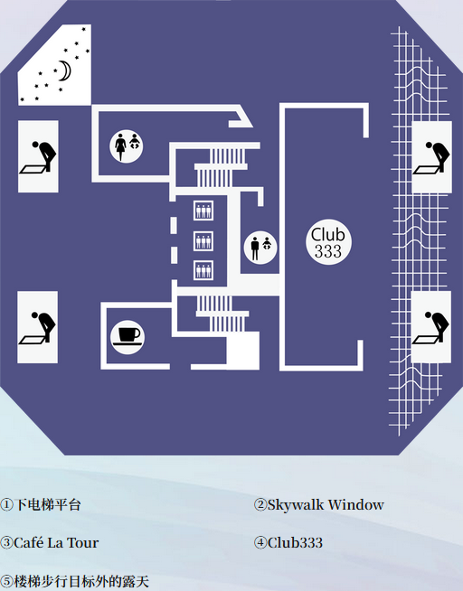
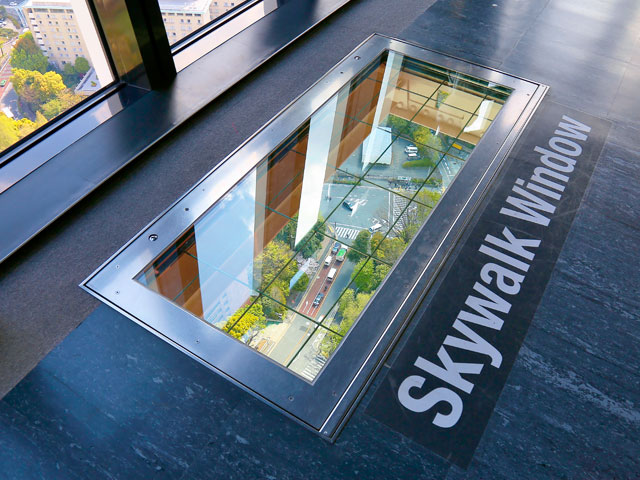
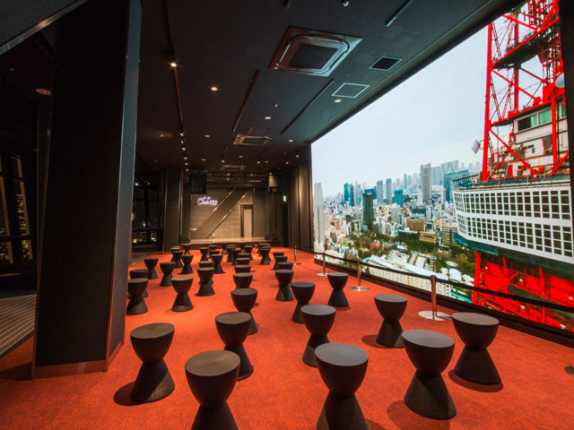

# 东京 Toyko

东京，旧名江户（即“河口”之意，起源于隅田川流入当时称为“江户内海”的东京湾）。

1603年，**德川家康**打败众多其它大名，完成日本的大一统，在**江户**建立城堡，创立江户**幕府**，开启了**江户时代**（德川家康成为日本的实际统治者，而当时的朝廷是丰臣政权，是丰臣秀吉的后代丰臣秀赖）。

1867年**大政奉还**（日本江户幕府的第十五代将军德川庆喜将政权还给了明治天皇，这一事件标志着持续264年的江户幕府统治结束）后，政治权力回到了天皇手上，也开启了明治维新。**都城**也随之从京都**迁至江户**，并改称为东京。

1923年关东大地震、二战期间大范围遭受美国空袭，曾让东京遭遇两次毁灭性的破坏，但随后却也都迅速进行重建工作，凭借在重建过程中充分考虑东京在震灾前就有的问题、灾后土地的收购顺利等因素，东京经济迅速恢复，目前已发展成为最现代化的城市之一。

东京的GDP为全球第二，在2016年达9,730亿美元，而同时东京都会区（一都三县）则高达1.8万亿美元，若将东京视为一个国家，其GDP总量高于加拿大、韩国、俄罗斯等，位列世界第八。东京为亚洲最重要的世界级城市之一，也是传统上的**全球四大世界级城市**（伦敦、纽约、巴黎、东京）之一。

东京于1964年、2020年共两次举办奥运会，也是目前第一个两次主办奥运会的亚洲城市。

## 1.1 路线

## 1.2 景点

### 东京铁塔

东京塔，正式名称为日本电波塔，建于1958年。高332.9米，是日本第二高的建筑。东京塔外形模仿巴黎埃菲尔铁塔建造，塔身间隔涂装白色和红色。

**门票**

|区域|成人|
|-|-|
|MAIN DECK（150m） 即主观景台|1500日元（约72.24人民币）|
|TOP DECK Tour (150m & 250m) 顶层观景台|网上购票3300日元（约158.93人民币） 柜台购票3500日元（约168.56人民币）|
|TOKYO DIAMOND TOUR(钻石之旅)|7000日元（约337.12人民币）|

FOOT TOWN

**MAIN DECK** 是一座两层的观景台

club333

钻石之旅 -需提前预约，1小时一批，参加者可以享受到头等舱贵宾待遇：在专属豪华休息室休息，通过专用通道和专属电梯前往顶层观景台；期间同行的表演者会以唱歌和表演等方式，为观景之行增添更多乐趣。

### 东京晴空塔

因城市发展，东京塔的高度不再满足这座巨大城市对信号发射塔的需求。东京决定再建造一座更高的塔。

东京晴空塔，也叫做“**天空树**”，竣工于2012年，高度634米，是东京目前的广播电视塔，也是目前为止全世界最高广播电视塔（比广州塔高34米）。（是世界第二高建筑，仅次于迪拜哈利法塔）

天空树的位置比东京塔偏西很多，也反映出了东京城市扩张的方向。

### 东京巨蛋

### 滨离宫恩赐庭园

### 歌舞伎町

### 歌舞伎座

### 东京都厅舍

### 明治神宫

### 阳光水族馆

### 谷根干

### 国立新美术馆

### 秋叶原

电器、3C、电玩、动漫商店，是二次元圣地

### 上野

上野公园（恩赐公园），内有很多，其中国立博物馆值得一逛

### 皇居

东京皇居，是德川城堡基础上改的旧皇宫，二战期间被炸毁。

### 东京站

东京站旁边的美术馆，是日剧《半泽直树》银行的原型

### 池袋

商业街区。

池袋地铁站西北口有华人聚集区（东西南部还有个横滨中华街）

### 新宿 新宿御苑

新宿，商业街区，内有摩天大楼集中区和企业总部、政府机关

新宿站，是世界最大地铁站

### 银座与日本桥

银座，城市中央区的商业街区

“日本桥”建造于德川家康在江户创立幕府那年（1603年），这座桥中间埋着“日本道路起点标记”，一如这里曾是江户时代的五街道起点，“日本桥”正是现代日本道路的起点

### 两国

### 六本木与赤坂

### 涩谷与下北桥

涩谷，更年轻化的商业街区、购物天地

涩谷十字路口，世界人流量最大的十字路口，红绿灯间隔为2分钟，每次绿灯时各个方向同时放行，有上千人穿行，被载入世界吉尼斯记录

涩谷SKY - 高楼

### 浅草 浅草寺

浅草寺在二战期间被炸毁，于1960年重建

#### 雷门

浅草寺外面的大门，悬挂一个大灯笼（由松下电器捐赠）

再外侧是长达250米的**仲见世商业街**

### 中目黑

### 原宿与表参道

### 台场

### 羽田机场、成田机场

### 下北泽 + 豪德寺

### 隅田川烟花大会
