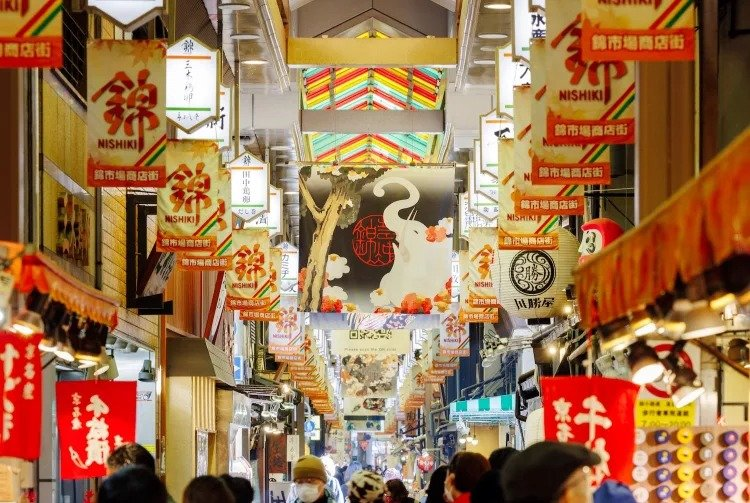
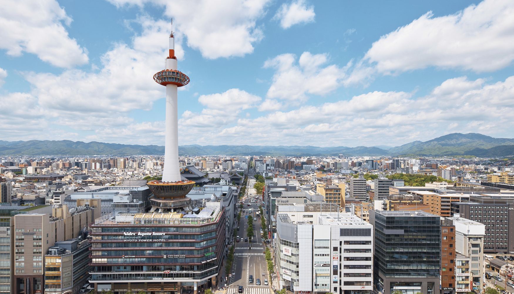
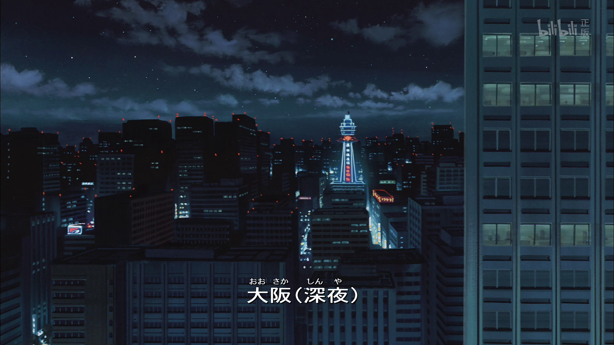

# 1 函馆

函馆(Hakodate)，位于北海道南部的渡岛半岛上，是北海道著名的港口城市，是《名侦探柯南：百万美元的五棱星》的拍摄地。

土方岁三 - 江户时代末期有着“鬼之副长”之称的新选组副队长。 
历史上的土方岁三本是一介卖药郎（家传石田散药），因结识近藤勇并被其一心想要成为武士报效公家的精神所感动，随后一起创建并率领新选组，一路佐幕攘夷。到最后，队员死的死伤的伤，或因政治理念不同选择脱队。 
而土方，在明知幕府已经无力回天，日本终将开国的时代潮流下，身着洋装却手握日本刀，面对强敌的枪炮丝毫没有畏惧，战斗到最后一刻，将武士道精神贯彻到最终，因此也被称之为日本“最后的武士”。土方岁三命丧黄泉之地，正是电影标题中《百万美元的五棱星》所指代的地方——北海道函馆市。

	
	

## 1.1 路线计划

## 1.2 旅游景点
### 1.2.1 金森红砖仓库

	
	

**地址**：北海道函館市末広町14番12号 
**门票**：免费 
※全年无休（年末、年初除外） 
**商店**〈购物店〉 
    10:00～19:00  
	每家店铺购物满5000日元（不含税）(约为 243.55 人民币，具体以汇率为准)方可享受免税服务 
**函馆啤酒城** 
    [平日]11:30～21:30 
    [节假日]11:00～21:30  

**历史简介**：安政6年（1859年），函馆与横滨、长崎一起作为日本首批国际贸易港开放。金森红砖仓库是在函馆开设的首个营业仓库

金森红砖仓库是由四座设施构成的综合商业设施，由1909年建造的红砖仓库改建而成。

**在电影里有隆重登场**

	第一处 <a href="https://hakodate-kanemori.com/facilities/bayhakodate">BAY HAKODATE</a>
	第二处 <a href="https://hakodate-kanemori.com/facilities/bayhakodate">金森洋物馆</a>
	 
	

		
		
	

	第三处 <a href="https://hakodate-kanemori.com/facilities/historyplaza">函馆历史广场</a>
	第四处 <a href="https://hakodate-kanemori.com/facilities/historyplaza">金森大厅</a>
	 
	

	
	
	

金森大厅面积约440平方米，可容纳约200人，配备照明、音响等设备，可用于音乐会、戏剧、讲座、电影欣赏，以及各种展览会、会议、婚礼和聚会等。过去，各种类型的音乐家曾在此举办音乐会。

#### 西波止场（金森红砖仓库隔壁的港口）

**参考网站**
https://hakodate-kanemori.com/

### 1.2.2 旧函馆区公会堂

	
	

**地址**：北海道函館市元町11番13号

|门票||
|-|-|
|博物馆门票|个人|
|普通票|300日元（约14.62人民币）|

|优惠联票|四馆联票|三馆联票|两馆联票|
|-|-|-|-|
|普通票|840日元|720日元|500日元|

**营业时间** 
夏季：4月1日至10月31日 
周二至周五：上午9:00至下午6:00 
周六至周一：上午9:00至下午7:00

冬季：11月1日至3月31日 
上午9:00至下午5:00

请在开放时间结束前30分钟入场。

**闭馆时间** 
2025年12月31日（周三）至2026年1月3日（周六） 
2025财年临时闭馆 
（博物馆将于以下日期全天闭馆进行维护和检查。） 
2025年4月14日（周一） 
2025年11月18日（周二） 
2026年1月20日（周二） 

**公会堂的主要特色**
① 该建筑是明治时期西式木结构建筑的代表作，展现了融合日式技艺的西式建筑风格。 
② 殖民时期风格（正面对称，两侧为山墙式山墙，阳台由科林斯式柱子支撑，并设有阁楼窗户）。 
③ 为两层木结构建筑，屋顶为瓦片。其建筑设计和施工技术堪称一绝。 
该建筑于1974年被指定为国家重要文化遗产，并于1980年开始历时三年、耗资4亿日元的修复工程，于1983年起向公众开放。

**旧公会堂的历史简介**
- 1910年（明治43年）
它最初是作为公众集会场所和商会办公楼而建造的。
首任会长相马彻平捐赠了约5.8万日元的建筑费用中的5万日元。
次年，即1911年，皇太子（后来的大正天皇）访问北海道期间曾下榻于此。
- 大正时代至战时（1912-1945年）
商会办公楼迁至此处，该公会堂也作为集会、庆典、音乐会、展览等场所广泛为公众所用。 
1922 年摄政王（后来的昭和天皇）也曾在此行宫使用； 
1927年（昭和2年），作家芥川龙之介和里见敦来此演讲。
- 战后混乱时期（1945-1956）
在战后混乱时期，该大厅还被用作军事总部和医院，后来又成为海事事故法庭和林务局的所在地。 
1954年洞爷丸台风期间，一楼餐厅曾举行过海事事故调查。
- 1957-1979
它再次被用作公共集会场所。 
门廊被修复，外墙被重新粉刷成粉色和白色。 
作为明治时代的西式建筑，其历史价值得到了认可，并于1971年被指定为县有形文化财产，1974年被指定为国家重要文化财产。
- 昭和维新（1980-1982）
首次的根本性保护和修复工程于1980年至1982年间进行。通过对建筑历史变迁的彻底调查，发现原公会堂的外墙原本是蓝灰色和黄色，建筑内部的房间布局也发生了变化。
- 昭和维新后（1982-2018）
1989 年天皇和皇后陛下访问北海道时，这里也曾作为行宫使用。 
该建筑向居民和游客开放。 
当时还提供服装租赁服务，让游客可以体验当时上流社会的魅力。它成为了该市著名的旅游景点之一，每年吸引约15万游客。 
它还作为一个终身学习设施，举办音乐团体的音乐会和当地高中生的户外茶道。

### 1.2.3 十字街(去函馆山的路上)

	

### 1.2.4 函馆山展望台（函馆山索道）

**地址**：北海道函馆市元町19-7

**车费**：往返：1,800日元，单程：1,200日元（分别约为87.71人民币，58.48人民币） 展望台免费开放

|营业时间 |头班车 |上行末班车 |下行末班车|
|-|-|-|-|
|4/20-9/30 |10：00|21：50|22：00|
|10/1-4/19 |10：00|20：50|21：00|

※注意查看具体落日时间

观景台一楼为山顶站及候车大厅，二楼设有餐厅，三楼设有茶室，可一边欣赏美景，一边享用美食美酒

**函馆山夜景**

	

有多种方法可以到达山顶，在那里你可以欣赏到绝美的夜景。
以下为从JR函馆站出发的三种交通方式。供您参考。 
①乘坐函馆山登山巴士或1路公交车直达山顶。 (冬季停运) 
②搭乘函馆索道接送车（2号线），在“山麓站前”下车，乘索道到山顶。 
③乘坐有轨电车，在“十字街站”下车。 然后步行10分钟到“山麓站前”。 再乘坐索道到山顶。 
(从十字街到山麓站有一个陡峭的斜坡，请小心。)

### 1.2.5 五棱郭公园

**地址**：北海道函館市五稜郭町44

**门票**：部分设施需付费。

**营业时间**：【京都】 5:00～19:00、（11～3月）5:00～18:00

**交通**： 
步行：从五稜郭公园前电车站步行约15分钟。 
驾车：从JR函馆站步行约15分钟。

**历史简介**：五稜郭公园不仅仅是柯南剧场版的舞台，也是日本近代最大的内战——戊辰战争的战场之一。当时希望天皇重新执政的以萨摩藩、长州藩、土佐藩为主要构成的新政府军，和旧江户幕府军展开了一系列的战斗，最终以新政府军的胜利而告终。其中，1868年发生的“箱馆战争”就是在函馆的五稜郭这里激战，这是旧幕府军的榎本武扬、土方岁三最后的要塞。

随着时光的变迁，1530棵樱花树已经将曾经的战场，装扮成全新的公园。五角星的轮廓与春日的樱花相映成趣，春风吹过，樱花的花瓣飘落到水面上，形成了“花筏（はないかだ）”，也成了五稜郭公园的春日特别景观之一。一年四季公园都十分适合观景和散步，到了夜晚，也会有灯光亮起

五棱郭公园里还有一座箱馆奉行所。此地在电影里也有登场。箱馆奉行所是幕府在日本北边设立的役所，主要负责与外国交涉以及虾夷地(后更名为北海道)管理等业务。在幕府解体后，箱馆奉行所也迎来了终结。直至近代，才按照过去的历史资料等对箱馆奉行所进行了复原重建。现在的箱馆奉行所对一般民众开放，里面陈列了关于五棱郭以及箱馆战争的历史资料等。

#### 五棱郭塔

**地址**：北海道函館市五稜郭町43-9

**营业时间**：9:00〜18:00

**门票**：1,200円（约为58.48人民币，具体以汇率为准）

参考网站：https://www.goryokaku-tower.co.jp/

### 1.2.6 北海道东照宫

**地址**：函館市陣川町82-153

**历史简介**：北海道东照宫也称作函馆东照宫，这里是北海道唯一的一座“东照宫”。所谓东照宫，其实特指的是供奉**德川家康**的神社，栃木县的日光东照宫，静冈县的久能山东照宫可谓东照宫中的代表。 江户时代末期，即1864年（源氏元年），幕府为了守护虾夷，在函馆市神山建造了这座寺庙。东照大权现（德川家康）从虾夷三官寺之一、位于日高町佐似的东朱院迁至此地。 1869年，因为箱馆战争的爆发，神社的社殿被毁，如今能看到的建筑为1992年重新移转至此的，神社内的“手水钵”是重要的历史遗迹，至今还能看到当年箱馆战争遗留下来的弹痕。

**门票**：免费

**参观时间**：9:00-16:00

### 1.2.7 函馆市营电车汤之川站

函馆市电自1913年开始运营，至今已有100多年的历史。它是东京以北第一条马拉铁路，后来根据公众需求进行了电气化，并经历了多次改造才发展到现在。 
汤之川巴士站位于**汤之川温泉**的入口处，该温泉是北海道南部首屈一指的温泉胜地之一。

### 1.2.8 八幡坂(坂道元町)

**地址**：北海道函館市元町・末広町

**交通**：市电：从末广町站步行约5分钟

**简介**：八幡坂是与函馆山夜景齐名的人气景点。据说，八幡坂的名字源于曾经位于山顶的函馆八幡宫。20世纪80年代，八幡坂作为电视广告的拍摄地而人气飙升，并被昵称为“魅力绿丘”。

### 1.2.9 函馆早市

从JR函馆站步行约1分钟就可抵达。

### 1.2.10 小丑汉堡

### 1.2.11 函馆警察署

### 1.2.12 函馆普乐美雅凯宾总统酒店

### 1.2.13 JR函馆站

### 1.2.14 新函馆北斗站

https://www.hakodate.travel/chs/courses/enjoy-exploring-hakodate-by-tram/

## 1.3 美食

## 1.4 住宿

作为知名的温泉胜地，汤川温泉绝对是当地居民和游客的绝佳疗愈场所，车站附近众多的免费足汤也十分方便。 
温泉胜地自然少不了住宿设施，这里不仅有多处快捷方便的现代酒店，也有许多历史悠久的旅馆供你选择。你甚至可以在露天浴场欣赏到津轻海峡的壮丽海景。 
喜欢保留私人空间的朋友，可以通过私人客房的露天浴场，体验幸福的疗愈时刻

# 2 京都

京都，是位于日本近畿地方（是日本本州岛中西部的地理区域）的都市。794年，桓武天皇以中国长安城为模板，建成“平安京”，并从长冈京迁都于此。在1869年迁都江户（东京）之前，京都一直是日本的政治与文化中心，被视作日本人的精神故乡。

## 2.1 路线计划

10:00 花見小路
10:30～11:30 八坂神社
12:00～13:30 宮川豚衛們（吃隱藏版炸豬排）
13:40～14:00 安井金比羅宮
14:10～14:30 八坂庚申堂
14:40～15:30清水坂逛街吃東西
15:30～17:00 清水寺
17:00～前往京都車站

	

## 2.2 景点

### 2.2.1 京都JR

### 2.2.2 八坂神社

**地址**

京都市东山区只园町北川 625 号

**门票**
免费

**历史**

被京都人以拟人化昵称为「祇园さん」的八坂神社，是祈愿疾病退散的「祇园神社」总本社。

这座神社的历史至少可以追溯到公元876年，当时圆城和尚邀请了掌管疾病预防的牛头天王来到神社，试图阻止当时京都居民遭受的流行病和其他灾难。这也是著名的祇园祭的起源。祇园祭的特色是华丽的花车和身着古装的人们组成的热闹游行队伍，最终在八坂神社结束。

	

	
	

### 2.2.3 花见小路

花见小路北起三条通，南至安井北门通约1公里，是贯穿祇园的主要通道。

	

- 禁止对艺妓拍照
- 禁止对周边的私人道路拍照（有禁止拍照的立牌）

### 2.2.4 清水寺

**地址**
京都市東山区清水1丁目294

**门票**
500日元（约24.29元人民币）

**交通方式**：
可从京都站乘巴士前往清水寺。
从京都站 出发，乘坐 100 和 206 号巴士前往五条阪或清水道站。从这两个巴士站再走 10 分钟的山路，即可抵达清水寺。

**历史**
音羽山清水寺始建于公元778年，距今约1250年，供奉象征大慈大悲的观世音菩萨。
清水寺占地13万平方米，寺内有30多座寺院建筑，其中一些被指定为国宝和重要文化遗产。自创建以来，清水寺曾遭遇过10多次大火，每次都毁于一旦，但虔诚的信徒们还是促成了寺院的重建。目前的大部分寺院建筑于1633年重建。1994年，清水寺作为“古都京都的历史遗迹”的一部分被列入联合国教科文组织世界遗产名录。

**地图**

	

#### 仁王门

#### 三重塔

#### 本殿
这座位于清水寺的国宝建筑建于江户时代初期。
本尊为十一面千手千眼观音立像，供奉于国宝神社，被视为秘传佛像。寺院每33年开放一次大门，这是惯例。最近一次公开瞻仰是在2000年，下一次是2033年。

	
	

清水寺是观世音菩萨的圣地。其本尊是“十一面千手观音菩萨”。这尊观世音菩萨拥有十一种面容和四十二条手臂，象征着大慈悲，能够拯救众生脱离困境。它被人们奉为祈求健康、事业进步、人缘好等世俗福祉的圣物，因此自古以来就被人们亲切地称为“清水观音”。

#### 清水舞台

	

从本殿延伸而出的“舞台”高约13米，相当于四层楼高。这个舞台是供奉清水寺本尊观世音菩萨的表演场所。舞台建于音羽山的陡峭悬崖之上，这种被称为“悬筑”的传统日本建筑工法，即使在施工困难的悬崖上也能建造抗震结构。

日本有一句知名谚语——从清水舞台跳下去(清水の舞台から飛び降りる)，清水舞台过去以高度而闻名，从清水舞台跳下去指的是「破釜沉舟的決心」的意思

舞台由18根埋在地下的柱子支撑。这些柱子由树龄超过400年的榉树制成，最大的柱子长约12米，周长约2米。柱子上横竖穿插着无数根横木。这种巧妙的木块连接方式被称为“承接”，无需一根钉子。现在的舞台重建于1633年。它经历了历史上的无数次灾害，如今依然支撑着这座每天都熙熙攘攘、熙熙攘攘的舞台。

	

		

			春
		

		

			
			
		

	

	

		

			夏
		

		

			
		

	

	

		

			秋
		

		

			
			
		

	

	

		

			冬
		

		

			
			
		

	

#### 子安塔
子安塔位于清水寺本殿对面，隔着鬼火溪谷的山丘上。这座三重塔（重要文化遗产）通体朱漆，覆以柏树皮，重建于室町时代后期。子安塔是清水寺的分寺，名为泰山寺，寺内供奉着一尊千手观音。据寺内传说，圣武天皇和光明皇后曾向这尊观音祈祷，祈求光明皇后平安降生，因此建造了这座塔以表达他们的感激之情

	

#### 音羽瀑布

	

在清水舞台的下方，有一个小神坛。音羽山上流下来的泉水经过神坛顶端留下来，形成三道小瀑布。

面对音羽山看这三道小瀑布，由左至右分别代表「学业」、「恋爱」、「长寿」。你只能选择一道瀑布的泉水饮用（音羽山上的泉水很干净，可以饮用），一次只能喝一口。

### 2.2.5 五条大桥

	
	
	 
	左图为牛若丸弁慶像(牛若丸辨庆像)

### 2.2.6 弁(biàn)庆石

传闻源义经仁安四年（1169年）十一岁时的某日，在回寺的路上，途经五条大桥时，遇见一位称为**武藏坊弁庆**的武勇僧侣拦路。

**弁庆**当时在该地进行“刀狩”，只要看上往来武士身上的太刀便要求比武，在遇到义经前已经强夺了999把太刀。

**弁庆**看上了义经身上所配之黄金宝刀，故技重施，岂料义经武艺高强，身轻如燕，庆虽然武勇纵横，但却处处受制，攻而屡挫。

义经让力过人且一向仗恃刚勇的升庆败得口服心服，从此升庆便跟随在义经左右，成为日后义经最亲密的家臣之一。

弁庆石 - 传说弁庆经常坐在这块石头上，也有人说这块石头是弁庆从叡(rui)山扔下来的。

### 2.2.7 蹴上斜坡铁道

东西向的京都地铁往东坐到**蹴上车站**。**蹴上斜坡疏水公园**本来是一个水利设施，是琵琶湖水利工程的一个遗址，铁道和公园内的一些管道都是为了修建水利设施而建设的。铁道是废弃的。

	
	

	
	

### 2.2.8 六角堂

从**蹴上斜坡**回来以后可以乘坐东西线到达**乌丸御池车站**，从乌丸御池出来之后向南走三个路口向左转进去就是**六角堂**了。

乌丸御池是连接京都东西线和南北线的交通要塞，要是自己想去的京都的景点大多是依靠地铁去的，那记住乌丸御池车站能让行程变得更加方便快捷。

	
	

	
	

### 2.2.9 佛光寺

离开六角堂继续往南走过了四条站两个路口之后往巷子里走就到了佛光寺

	
	

### 2.2.10 戻(tì)桥

沿着二条城东边对面的路向北走的就可以看到这个戻桥的路口

	
	
	

### 2.2.11 伏见稻荷大社

**地址**
68 Fukakusa Yabunouchicho, Fushimi Ward, Kyoto, 612-0882日本
(京都市伏见区深草薮(sǒu)之内町68号)

**门票**
免费

**游玩时间**
认真逛大概3小时

**交通**

【电车】
- 搭乘JR奈良线，于稻荷站下车即达（为自京都站起第2站，车程5分钟）
- 搭乘京坂本线，于伏见稻荷站下车，向东步行5分钟

【市营巴士】
- 搭乘南5系统，于稻荷大社前下车，向东步行7分钟

“稻荷神社”堪称是最贴近日本人生活的神社。据说全国共有3万座稻荷神社，在日本各地受到男女老幼的喜爱。其总本宫便是京都的伏见稻荷大社。

本神社的祭奉神明──稻荷大神，是在奈良时代的和铜4年（公元711年）二月初午之日镇座至稻荷山。从那一日算起，平成23年（公元2011年）已迎来神明镇座1300年。

稻荷大神被尊崇为“掌管衣食住的根基，庇佑所有人生活富饶快乐的神明”，作为保佑五谷丰登、商业兴盛、家庭安全、诸愿望皆得实现之神。

	

	

	

### 2.2.12 锦市场

到了江户时代（西元1615年），「锦之店」（即现在的锦市场）与京都的「上之店」、「六条店」同被幕府认定为拥有特权的「鱼批发市场」之一。来到昭和时代成为「京都的厨房」，并发展成商店街。

锦贸易集市位于一条长约400米、宽仅3.9米的狭长街道内，百余家店铺鳞次栉比。锦市场贩卖各种新鲜与腌渍食品，包括特色鸭货、日式甜点和各种腌渍食品。您也可以在这里买到绝佳的厨房用具、雅致的瓷器、佐料与纸制商品。

江户时代（1716年）诞生在锦市场的天才画师伊藤若冲。从市场入口到天花板上挂的帆布旗，还有店家的铁卷门上，都是伊藤若冲的画作。他的不少作品被指定为日本国宝，而且是日本皇室「宫内厅」的重磅馆藏！

**美食举例**
富美家 - 锅烧乌龙面
三木鶏卵 - 日式高汤蛋卷
田中鸡卵 - 玉子烧
Kari Kari 博士 - 章鱼烧
木村鲜鱼店 - 新鲜海产

### 四条通

### 2.2.4 平安神宮

### 2.2.5 嵐山竹林

### 2.2.6 金閣寺

### 2.2.8 東寺

### 2.2.9 鞍馬寺

	

	
	
	

	
	

**地址**

**交通**

搭乘京阪线前往出町柳站。换乘叡山电铁线，在鞍马站下车。往山上步行约 10 分钟，即能到达鞍马寺。

200 日元（约9.75元人民币）就能搭乘缆车轻松到达正殿所在的山上。

**历史**
鞍马寺创立于 8 世纪。传说，一位名为鉴真的中国和尚出现在某位门徒的梦中，告诉他鞍马山充满特别能量，于是这位门徒遵照鉴真的指示前往鞍马，并建造了一座能利用强大灵力的神秘寺庙。

现在依然有人相信该地区有天狗（一种山上的妖怪）。相传义经（_源义经，幼名牛若丸，日本平安时代末期的著名传奇武将_）在山上的“僧上谷不动堂”遇见天狗学到的剑法。

鞍马寺原隶属于三个佛教宗派，直到战后才改变，当时的寺庙住持信乐香云创立了自己的宗教并与原本的佛教完全剥离。目前，该寺仍然植根于对鞍马山的崇拜，以自然的灵性和山岳崇拜为中心。

### 2.2.10 南禪寺

### 金刚寺

### 2.2.13 鸭川

鸭川是一条流经京都市中央、长31公里的一级河川，这里孕育出了义经、弁庆的传说故事。这条河流的水十分清澈，从古代起居民已经住在河流的两旁，特别是西岸及南岸。虽然京都已不是首都，但仍然有很多外国及本地游客到来游览。河流两旁有步行径及单车径

源义经是日本家喻户晓、最具人气的英雄人物，曾协助其兄**源赖朝**获得了对整个日本的统治权（镰仓幕府）。因其功高震主以及出色的才能，后来遭到既是兄长也是主君的**源赖朝**的猜忌，经过一系列复杂的政治斗争和战斗，最后含冤而死。

### 建仁寺

**门票**
800日元(约38.96人民币)

建仁寺是由一位从中国带来多种茶叶的僧侣创建的。寺院内矗立着一座石像，上面用汉字写着“茶之碑”。

建仁寺与日本的两位禅宗「大师」有密不可分的关系。**荣西和尚**创立临济宗，是将佛教禅宗传入日本的第一人，**道元**则创立了曹洞宗禅法。两位禅师在 1200 年代早期，不远千里地跋山涉水到中国，并将佛教禅宗传回日本。这两位禅师皆长眠于建仁寺。

建仁寺的现址可追溯至 13 世纪，是少数仅存的 13 世纪遗址。寺庙原本的建筑和多数的京都建筑物一样，皆在大火中付之一炬。

建仁寺里最古老的建筑就是矢立门 (Arrow Gate)；这个名称来自于门上的箭孔，是在让大部分京都烧毁殆尽的应仁之乱（1467 - 1477 年）中所留下的痕迹。

	

		
		
	

	

		
		
		
	

建仁寺里到处都是重要的艺术与设计作品，包括画作、雕塑，以及一个禅意花园。

在这里可以欣赏到的最知名作品，就是俵屋宗达壮丽的风神雷神图屏风（复制品，原作现藏于京都国立博物馆）。进入主殿后，天花板上的双龙壁画是较近代的作品。

### 京都塔

**门票**
900日元（约43.81元人民币）

**营业时间**
|楼层|时间|
|-|-|
|2F|10:00 ~ 19:00|
|1F|10:00 ~ 21:00|
|B1F|11:00 ~ 23:00|

|楼层||
|-|-|
|B1~2F|商店|
|1~3F| 餐厅 Saikatei |
|4F| 餐饮 DANIEL'S LUCE、關西旅遊資訊服務中心京都|
|5~9F|京都塔酒店|
|10F|餐饮 ROOFTOP BAR & BBQ|
|展望室 3F|天空休息室“ KUU”|
|展望室 4F、5F||

京都塔竣工于第一次东京奥运的举办年1964年。自2024年4月1日起更名为「Nidec京都塔（ニデック京都タワー）」，即“日本电产京都塔”。

位于主塔展望室4楼・5楼的「Nidec京都塔展望室」，可体验地面高度100ｍ的美景。（望远镜免费）
由于展望室的360度均为玻璃帷幕，可将高楼大厦不多的京都每个角落的街景都一览无遗，绝佳的眺望视野是其魅力所在。
清水寺、东寺等京都最具代表性的国宝・世界遗产也可尽收眼底。

### 将军塚(zhǒng)青龙殿

**景色一般般，感觉可以不去**

**门票**
600日元（约29.21元人民币）

**历史简介**

将军冢青龙殿，在京都市山科区的东山山顶。

据说那里就是古老京都的起源。8世纪中叶，桓武天皇来到此地为新都选址，由于登高远望之景甚得天皇喜爱，于是在 794 年下令修建京都城。

- 龙殿和大日堂都是山脚处青莲院的一部分。
- 桓武天皇修建的一个两米高的坟丘。
- 在将军冢内埋下了一座身披盔甲的将军雕像，随附铁弓、宝剑和利箭，用以护佑京都。

**路线**
从临四条街的八坂神社 出发穿过圆山公园，先到达知恩院 和青莲院，最后来到将军冢。

### 无邻庵(an)

**地址**
京都市左京区南禅寺草川町31番地

**参观需提前预约**
https://murin-an.jp/cn/info-2/

**门票**
2026年
1月1日(四)～1月3日(六)：1000日元
3月28日(六)～3月31日(二)：1000日元（约48.70人民币）
其他日期600日元（约29.22人民币）
600日元

**如需摄影，请在摄影前申请摄影资格并支付费3万日元（约1461.09）摄影费**

	

无邻庵是散步花园，是政治家山县有朋（1838 年 - 1922 年）在日本实行快速现代化计划时，建造无邻庵以作为自己的退休别苑，同时流露出对西洋建筑风格的喜好。

这座庭园由小川治兵卫 (Ogawa Jihei)（1860 年 - 1933 年）设计，他是知名园艺家族的第七代园艺大师。

是京都游客最少的景点

山县有朋是明治维新的重要人物，他终止了长达 264 年的幕府政权，并以由天皇领导的新政体取而代之。山县有朋最初反对开放日本与外国进行贸易。不过，在意识到日本无力反抗西方军事武力后，他便以首相身份着手进行日本军队的现代化建设。

## 2.3 美食

热汤豆腐

## 2.4 住宿

# 3 大阪

### 天守阁

### 通天阁

通天阁是位于日本大阪府大阪市浪速区新世界商业街的一个瞭望塔。是由建筑师内藤多仲所设计，他也是东京铁塔的设计者。通天阁意为通往新世界的塔，这座通向天空的塔形建筑或许从现在来看显得有点简陋破旧，但是晚上，却是大阪最闪亮的存在。

	

# 4 东京

### 东京塔

# 5 富士山

