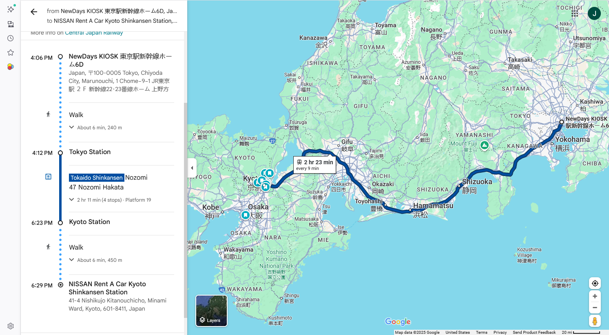
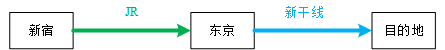
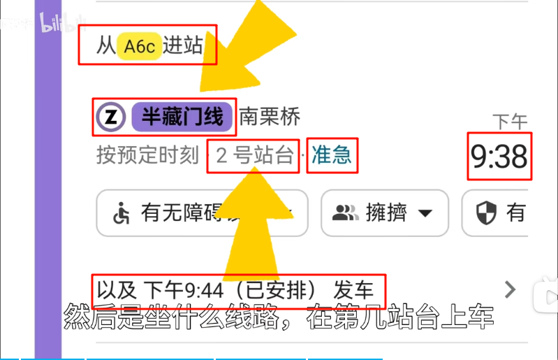

[读完就懂！彻底讲解东京交通大小事](https://www.gltjp.com/zh-hans/article/item/20004/)
# IC卡乘坐大多数公共交通

[Suica](https://www.jreast.co.jp/zh-CHS/multi/pass/suica.html)适用于首都圈的铁道、地铁、巴士、单轨电车。除首都圈以外，Suica还适用于仙台/新潟、青森、盛冈、秋田、北海道、东海、西日本、冲绳区域的部分交通设施。

[ICOCA](https://www.jr-odekake.net/icoca/)卡，押金500日元（约24.30元人民币），苹果用户支持线上办理

一次充值金额为500日元、1,000日元、2,000日元、3,000日元、5,000日元、10,000日元。支持多次充值，上限为20,000日元。

充值仅收现金。Suica不支持信用卡充值。

## JR西日本办理

## JR东日本办理

还有其它JR办理的卡

在使用上没有任何区别，全国通用。

但关西的卡只能在关西的特定站点办理退卡，关东同理，所以建议别一次性充太多钱。

有给外国游客使用的IC卡“Welcome Suica”，1000日元起可购入(约48.61元人民币)，从购买日起可使用28天，因为不能退还，所以可以把它作为伴手礼带回家。

建议直接用苹果手机的线上IC卡

# 特急车

特急车也是地铁，地铁还有“**普通车**”或“**各停车**”

特急车需单独购票，不能刷公交卡。

特急车在中间某些站点是不停车的。

# 新干线

新干线相当于高铁，需要单独购票，车站的机器上就能买。

一般会出两张票：“乘车券”+“特急券”

[日本新干线购票攻略](https://www.bilibili.com/video/BV1AhQuYNEgS/?share_source=copy_web&vd_source=12d3eb348136836a7399530d558b3f84)

[保姆级教程之日本交如何乘坐新干线](https://www.bilibili.com/video/BV1Fx4y1d72j/?share_source=copy_web&vd_source=12d3eb348136836a7399530d558b3f84)

## “指定席”和“自由席”
指定席可以选班次、座位，价格会略贵
自由席只能在几个固定的车厢，但不限定班次（即一天之内坐购买站点间的任一一班即可）。同时指定席在错过班次后，也就变成了自由席

## 绿色车厢

绿色车厢比起一般的普通车厢座位较为宽敞, 且可能有较少的孩子或年纪轻的团体乘客, 环境上较不吵杂。

## 以下仅是举例，具体以实际为准

新干线的价格相对贵，从东京到京都，自由席位：成人 13,320日元（约647.43元人民币），指定座位：成人 14,170日元（约688.74元人民币）（[参考网站-非官方网站](https://japantravel.navitime.com/zh-cn/area/jp/depArrTimeList/00006668/00001756/00000110?direction=down)）

所需时间因乘坐列车不同而有大概三个时间，3小时28分钟、2小时34分钟、2小时 07分钟

从东京到京都的新干线是由[JR东海](https://global.jr-central.co.jp/zh-CN/)运营的

如果坐飞机，仅飞行所需时间为1小时左右，价格约1323.49元人民币

## 知乎上的一个例子，是反面案例

1. 乘坐JR电车从新宿到东京站，从东京站买票乘坐新干线，由于我在新宿上车的时候刷了西瓜卡，此时直接乘坐新干线，西瓜卡会被锁；
2. 这种很没有必要，因为把乘车券分两段买，会贵一些；
3. 如果你在非新干线车站买票（比如新宿上车在东京换乘新干线），你就需要一张新宿——目的地的乘车券和一张东京——目的地（或者新干线下车站）的特急券
4. 如果已经决定坐新干线了，那么在新宿就不应该刷IC卡支付额外的新宿-东京的费用，而应该在新宿的自动售票机处购买从新宿去目的地的新干线票；
5. 在改札的时候，应该把拿到的几张票一起塞进改札机，进行一次改札；
6. 之后坐在来线（在来線是源于日本的铁道用语，意指新干线以外的JR或旧国铁铁线路，比如山手线）到了东京再把这些票一起塞进改札机去新干线的区域，进行二次改札。然后坐新干线；
7. 到了目的地再反过来，先出新干线的改札，你会少一张票子，然后再出目的地的改札，票子都没了，也到了目的地；

总之，就是如果要坐新干线，就直接去新干线的机台上买票

# JR

JR（Japan Railways）是日本全国性的大型铁路集团，由1987年日本国有铁道（国铁）分割民营化后成立的7家地区性铁路公司组成，各自独立经营但共享同一个JR集团的标志。JR铁路网络遍布日本，提供从新干线到本地列车等多样的交通服务，是游客在日本旅行时常用的交通方式，并且为外国游客提供专用的优惠票券，如日本铁路通票(JR Pass)

7家公司主要包括
- [JR北海道](https://www.jrhokkaido.co.jp/)
- [JR东日本](https://www.jreast.co.jp/zh-CHS/multi/)
- [JR东海](https://global.jr-central.co.jp/zh-CN/)
- [JR西日本](https://www.westjr.co.jp/global/sc/)
- [JR四国](https://www.jr-shikoku.co.jp/)
- [JR九州](https://www.jrkyushu.co.jp/)
- 以及作为货运公司的*JR货物*

**7日通票**从之前的29,000日元（约1,409.57元人民币）涨价到50,000日元(约2430.29元人民币)，大概要在7天内坐4次新干线才能回本。

JR Pass 是可以买指定席的

|Type|Green|Ordinary|
|-|-|-|
|Duration|Adult|Adult|
|7-day|70,000(约3,402.41元人民币)|50,000(约2430.29元人民币)|
|14-day|110,000(约5,346.64元人民币)|80,000(约3,888.47元人民币)|
|21-day|140,000(约6,804.82元人民币)|100,000(约4,860.58元人民币)|

[参考网站japanrailpass](https://japanrailpass.net/zh/)

[官网-日本铁路通票的详情请查看此处](https://japanrailpass.net/assets/pdf/JRP_Leaflet_En_2025.pdf)

# 日本导航神器

谷歌地图

严格地、一丝不苟地、准确无误地跟着谷歌地图走：

“入站口”、“坐什么线”、“几号站台”、“地铁类型”、“几点上车”，“如果没赶上则下一班列车是什么时间”，可以说一次导航里全是重点

如果导航让坐普通车，错坐了急行车，那么就会错过本该下车的站点

如果导航让坐急行车，错坐了普通车，就会慢慢悠悠地浪费很多时间

坐错了车厢，有可能中途会被另一辆列车带到别的线上去（去关西机场的路上最典型）

以及神奇的是，日本地铁会**无缝切换路线**（并不是像国内的地铁，一条线内的车就在区间运行）。如果导航显示你切换了线路，但不要求你换乘，那么就是这种情况，但如果是坐错了，那么就跑偏了。

在日本，地铁、普通火车、高铁三者之间很大程度上是一体化的，不像国内界线分明，因此很多车站都不是各线独立的设计，造成了“无缝切换”

不仅地铁如此，公交也是如此。

另外，**乘坐公交车**，如果下车，**要提前按座位旁边的按钮**，否则司机可能不停车

总之一句话，严格执行导航软件给的指示。

# 参考连接
[一人游│日本地铁有多变态？一个视频带你轻松玩转日本人自己都坐不明白的轨道交通！│日本篇•交通攻略](https://www.bilibili.com/video/BV1mkSnYBEq9/?share_source=copy_web&vd_source=12d3eb348136836a7399530d558b3f84)

[日本交通太复杂了！没人带连票都不会买，手把手带着你看看公共交通全流程，看完就会了](https://www.bilibili.com/video/BV1a5H9eUEFg/?share_source=copy_web&vd_source=12d3eb348136836a7399530d558b3f84)

[来日必看~如何乘坐日本电车【乘电车时注意事项】日本电车站内设施说明（真人示范，超详细解说）](https://www.bilibili.com/video/BV1wW411e7as/?share_source=copy_web&vd_source=12d3eb348136836a7399530d558b3f84)